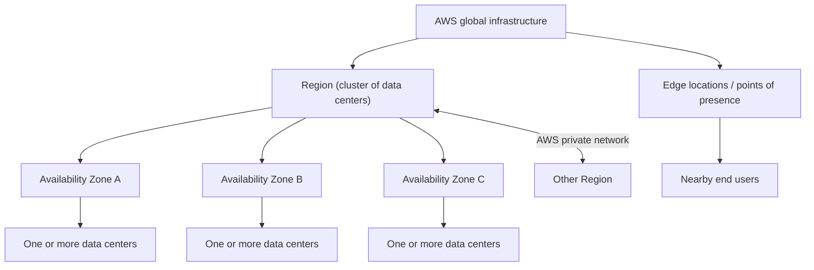

# AWS global infrastructure and service scope

AWS Regions scope most deployments, Availability Zones isolate failures within a Region, and edge locations move delivery closer to users.

## Infrastructure hierarchy

| Boundary | Composition | Engineering role |
| --- | --- | --- |
| Region | A named geographic cluster of data centers and Availability Zones | Primary deployment location and scope for most AWS services and resources |
| Availability Zone | One or more discrete data centers with redundant power, networking, and connectivity | Intra-Region failure-isolation boundary connected to peer zones with high-bandwidth, low-latency networking |
| Data center | Physical infrastructure inside an Availability Zone | Underlying compute, storage, and network facility; not normally selected directly |
| Edge location / point of presence | AWS delivery infrastructure geographically closer to users | Reduces content-delivery latency |

Regions also connect through an AWS-operated private network. That connectivity
is a transport capability; application data replication, routing, and failover
still require explicit service and workload configuration.

## Region and Availability Zone identifiers

- Region identifiers include `us-east-1`, `eu-west-3`, and
  `ap-southeast-2`.
- Availability Zone identifiers append a letter to a Region code; the lesson's
  Sydney example uses `ap-southeast-2a`, `ap-southeast-2b`, and
  `ap-southeast-2c`.
- The transcript describes three zones as common and states a range of three to
  six per Region. Treat these counts as source-era observations because AWS
  infrastructure changes over time.

## Service scope

Most AWS services are Region-scoped: selecting another Region generally means
working with a separate regional deployment and separate regional resources.
Some services present a global control plane or global resource behavior.

The course gives this introductory, non-exhaustive classification:

| Course-level scope | Examples named in the lesson |
| --- | --- |
| Global | [IAM](../iam/aws-identity-and-access-management.md), Route 53, CloudFront, WAF |
| Region-scoped | EC2, Elastic Beanstalk, Lambda, Rekognition |

This table is a learning aid, not a deployment contract. A service can have
resource types, integrations, or features with different scoping rules, and
regional service availability evolves. Verify the specific service and resource
in current AWS documentation before implementation.

## Design implications

- Make the target Region explicit in infrastructure, application, and
  deployment configuration.
- Use separate Availability Zones when a workload must tolerate the loss of one
  zone. This benefit exists only when the application actually places redundant
  components and dependencies across zones.
- Do not infer multi-Region replication or failover from AWS backbone
  connectivity.
- Use edge delivery to reduce distance to end users; it does not automatically
  make the regional application origin highly available.
- Model service scope explicitly because it determines where resources,
  configuration, state, and failover mechanisms live.

The second and fourth bullets are architecture inferences from the failure and
latency boundaries described by the course; the transcript does not provide a
concrete workload blueprint.

## Mutable source claims

The transcript states that AWS had more than 400 points of presence in 90
cities across 40 countries and describes current Region/AZ counts and service
availability through course examples. Preserve these as historical evidence,
not durable invariants. Current infrastructure maps, service documentation, and
regional service tables are authoritative for a new design.

## Related

- [Selecting an AWS Region](selecting-an-aws-region.md)
- [AWS Identity and Access Management (IAM)](../iam/aws-identity-and-access-management.md)
- [Source transcript](sources/2026-07-28-ultimate-aws-certified-developer-associate-2026-dva-c02-aws-cloud-overview-regio.md)
- [IAM introduction source](../iam/sources/2026-07-28-iam-introduction-users-groups-policies.md)
