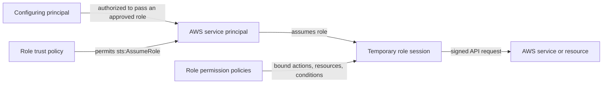

# AWS IAM roles for services

An IAM service role is an assumable AWS identity that lets a trusted AWS service perform bounded actions using temporary credentials.

## Authorization boundaries

Three independent controls must line up:

| Control | Governs | Typical failure |
| --- | --- | --- |
| Configurer's `iam:PassRole` authorization | Which role a principal may associate with a service | A deployer can pass a more privileged role than intended |
| Role trust policy | Which principal may assume the role | An unintended service, account, or identity can obtain a role session |
| Role permission policies | What the assumed role session may do | The workload can call excessive actions or access excessive resources |

The trust policy is a required resource-based policy attached to the role.
Permission policies are identity-based policies attached to the role. Passing a
role is a setup-time authorization check; assuming it creates the runtime role
session.

## Role lifecycle

1. Create a role with a trust policy for the intended AWS service principal.
2. Attach least-privilege permission policies for the workload's required API
   calls.
3. Allow deployment identities to pass only the approved role to the intended
   service.
4. Associate the role through the service's configuration mechanism.
5. The service assumes the role and obtains temporary credentials.
6. The runtime's SDK or CLI discovers the credentials and signs AWS API
   requests.
7. AWS refreshes the temporary credentials; applications should not persist or
   redistribute them.

The exact assumption and delivery details are service-specific, but the trust,
permission, and temporary-session model is stable.

## Common service-role patterns

### Amazon EC2

EC2 uses an **instance profile** as the container that passes one IAM role to an
instance. The role's trust policy permits `ec2.amazonaws.com` to assume it.
Applications on the instance can obtain automatically rotated temporary
credentials through the Instance Metadata Service, and standard AWS SDK
providers use them without application-managed secrets.

An instance can have only one IAM role association at a time, while the same
role can serve multiple instances. Keep role permissions aligned with every
workload sharing that role.

### AWS Lambda

Every Lambda function has an **execution role**. Lambda assumes it when invoking
the function, and the function uses the resulting permissions for actions such
as writing logs or accessing application resources. Add only the permissions
the function needs; invocation permission and execution-role permission are
separate concerns.

### AWS CloudFormation

A **CloudFormation service role** lets CloudFormation create, update, or delete
stack resources under explicit permissions. Its trust policy permits
`cloudformation.amazonaws.com` to assume it, and a caller must be authorized to
pass it.

Treat the service role as a deployment security boundary. Anyone permitted to
operate a stack that uses the role can cause CloudFormation to act with the
role's permissions through supported stack operations, even when the caller
does not directly possess those resource permissions.

## Service role versus service-linked role

| Type | Ownership and use |
| --- | --- |
| Service role | An IAM administrator creates and manages a role that an AWS service assumes for a chosen use case |
| Service-linked role | A service-owned subtype linked to one AWS service, with service-defined permissions and lifecycle constraints |

Do not use the terms interchangeably. The course examples are service-role
patterns; it does not establish that each named role is service-linked.

## Design checks

- Does the trust policy name only the intended service principal and required
  conditions?
- Can deployment identities pass only approved roles to approved services?
- Are role actions, resources, and conditions least-privileged?
- Does each shared role represent workloads with the same permission needs?
- Does the runtime use automatically supplied temporary credentials instead of
  long-lived access keys?
- Is credential delivery protected, especially EC2 instance metadata?
- Are role use and resulting API calls observable in audit logs?

## Related

- [AWS Identity and Access Management (IAM)](aws-identity-and-access-management.md)
- [AWS programmatic credential handling](aws-programmatic-credential-handling.md)
- [Least-privilege access with AWS IAM](least-privilege-access-with-aws-iam.md)
- [AWS programmatic access: CLI and SDKs](aws-programmatic-access-cli-and-sdks.md)
- [Source lesson](sources/2026-07-28-iam-roles-for-aws-services.md)
- [AWS IAM role concepts](https://docs.aws.amazon.com/IAM/latest/UserGuide/id_roles.html)
- [AWS `iam:PassRole` guidance](https://docs.aws.amazon.com/IAM/latest/UserGuide/id_roles_use_passrole.html)
- [IAM roles for Amazon EC2](https://docs.aws.amazon.com/AWSEC2/latest/UserGuide/iam-roles-for-amazon-ec2.html)
- [How Lambda works](https://docs.aws.amazon.com/lambda/latest/dg/concepts-basics.html)
- [CloudFormation service roles](https://docs.aws.amazon.com/AWSCloudFormation/latest/UserGuide/using-iam-servicerole.html)
