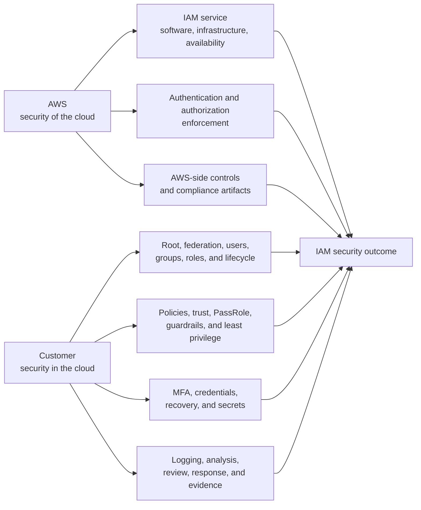

# AWS shared responsibility model for IAM

AWS operates and secures the IAM service, while customers remain accountable for identity design, permission configuration, credential protection, monitoring, remediation, and customer-side compliance.

## Responsibility boundary

AWS can securely operate IAM and correctly enforce every supplied policy while
the customer's account remains insecure because of a shared identity, broad
role trust, excessive permissions, missing MFA, exposed credentials, or absent
monitoring. Service security and customer configuration are separate control
layers that combine into the security outcome.

## IAM control matrix

| Control area | AWS responsibility | Customer responsibility |
| --- | --- | --- |
| Service operation | Protect and operate the IAM hardware, software, networking, facilities, and service planes | Design for documented IAM behavior, quotas, propagation, and resilience |
| Authentication and authorization | Authenticate requests and evaluate applicable policies according to IAM semantics | Select the identity model and configure root access, federation, users, groups, roles, policies, trust, boundaries, sessions, and organization guardrails |
| MFA and sign-in | Provide supported MFA capabilities and service defaults or requirements | Define coverage, configure identity-provider and IAM settings, secure recovery, manage exceptions, and verify enforcement |
| Credentials | Protect AWS service-side credential handling and provide temporary-credential mechanisms | Avoid unnecessary long-lived credentials, protect secrets, assign owners, remove unused credentials, and update unavoidable access keys when needed or required |
| Permissions | Provide the policy language, evaluation engine, managed artifacts, and analysis tools | Define access requirements, attach and scope policies, constrain role assumption and passing, test denial paths, and reduce permissions |
| Monitoring and response | Emit documented service telemetry and operate AWS-side detection and infrastructure response | Enable and retain required evidence, analyze activity, investigate findings, revoke access, recover, and verify remediation |
| Vulnerability and configuration management | Patch and remediate AWS-operated infrastructure and managed service layers | Configure selected services and patch customer-controlled operating systems, applications, or service updates as applicable |
| Compliance | Validate AWS-operated controls and provide AWS compliance reports and artifacts | Identify obligations, map inherited and shared controls, configure workloads, collect customer evidence, and validate end-to-end compliance |

## AWS-provided is not AWS-configured

AWS provides IAM features and can maintain some artifacts, but the customer
still owns their use:

- an **AWS-managed policy** is maintained by AWS, while the customer decides
  where it is attached and whether its permissions fit;
- a **service-linked role** can be created and managed through an AWS service,
  while the customer decides whether to enable and configure that service;
- IAM or Identity Center can provide **MFA capabilities and defaults**, while
  the customer owns workforce coverage, external identity-provider settings,
  recovery, and exceptions;
- Access Analyzer, credential reports, Last Accessed, CloudTrail, and other
  tools provide **evidence**, while the customer owns interpretation,
  authorization changes, rollout, and validation.

Automation can execute a control, but it does not become the accountable owner
of the control objective.

## Service- and control-specific variation

The model is not a single fixed line across every AWS service:

- AWS manages more of the operating system and platform for abstracted managed
  services than for an EC2 guest operating system.
- Configuration management is shared by layer: AWS configures its
  infrastructure; customers configure their accounts, resources,
  applications, and customer-controlled service options.
- Vulnerability and patch management depend on which layer is AWS-operated and
  whether the service requires customer scheduling or application action.
- Compliance includes inherited AWS controls, controls implemented separately
  by both parties, and customer-specific controls.

For each control, identify the service, deployment model, responsible layer,
required evidence, customer owner, and failure response. “AWS service” alone
is not enough to determine ownership.

## MFA boundary

The course says customers enable MFA “on all accounts.” More precisely:

- every AWS account type requires MFA for its root user under current AWS
  guidance;
- MFA also applies to IAM users, IAM Identity Center users, and federated
  identities rather than to an account as a whole;
- customers remain responsible for workforce authentication policy, identity
  provider configuration, privileged-action requirements, recovery paths,
  coverage review, and exceptions;
- IAM Identity Center includes MFA defaults, but customers must still validate
  that the end-to-end sign-in design meets their requirements.

## Access-key lifecycle boundary

“Rotate all keys often” is too broad to serve as an operating rule:

1. Prefer federation, roles, and temporary credentials that expire and refresh
   automatically.
2. Remove unused long-lived access keys rather than repeatedly rotating them.
3. Update a remaining IAM-user access key when needed, including suspected
   compromise, personnel or ownership change, and a documented risk or
   compliance schedule.
4. Rotate safely by creating a replacement, updating consumers, checking use,
   deactivating the old key, validating the new path, retaining a short
   rollback window, and then deleting the old key.
5. Define separate lifecycle policy for KMS keys, SSH keys, signing keys, and
   other credentials; they are not interchangeable with IAM access keys.

## Review questions

- Is each IAM control assigned to an accountable customer owner?
- Which layer is AWS-operated, customer-operated, or shared for the selected
  service?
- Are AWS-managed artifacts being mistaken for least-privilege approval?
- Does MFA coverage include root, workforce, privileged, and recovery paths?
- Can any long-lived credential be eliminated in favor of temporary
  credentials?
- Are remaining credential-update triggers and any cadence documented?
- Are policy, trust, and role-passing changes tested for both required success
  and expected denial?
- Are monitoring evidence, retention, review cadence, remediation authority,
  and rollback defined?
- Do compliance procedures map AWS evidence and customer evidence without
  assuming that an AWS certification covers the workload automatically?

## Related

- [AWS Identity and Access Management (IAM)](aws-identity-and-access-management.md)
- [AWS IAM security baseline](aws-iam-security-baseline.md)
- [AWS programmatic credential handling](aws-programmatic-credential-handling.md)
- [Reviewing AWS IAM credentials and permissions](reviewing-aws-iam-credentials-and-permissions.md)
- [Shared Responsibility Model for IAM source](sources/2026-07-28-shared-responsibility-model-for-iam.md)
- [AWS Shared Responsibility Model](https://aws.amazon.com/compliance/shared-responsibility-model/)
- [AWS Well-Architected shared responsibility](https://docs.aws.amazon.com/wellarchitected/latest/security-pillar/shared-responsibility.html)
- [AWS security design principles](https://docs.aws.amazon.com/wellarchitected/latest/security-pillar/security.html)
- [AWS MFA guidance](https://docs.aws.amazon.com/IAM/latest/UserGuide/gs-identities-mfa.html)
- [AWS secure access-key guidance](https://docs.aws.amazon.com/IAM/latest/UserGuide/securing_access-keys.html)
- [AWS access-key update guidance](https://docs.aws.amazon.com/IAM/latest/UserGuide/id-credentials-access-keys-update.html)
