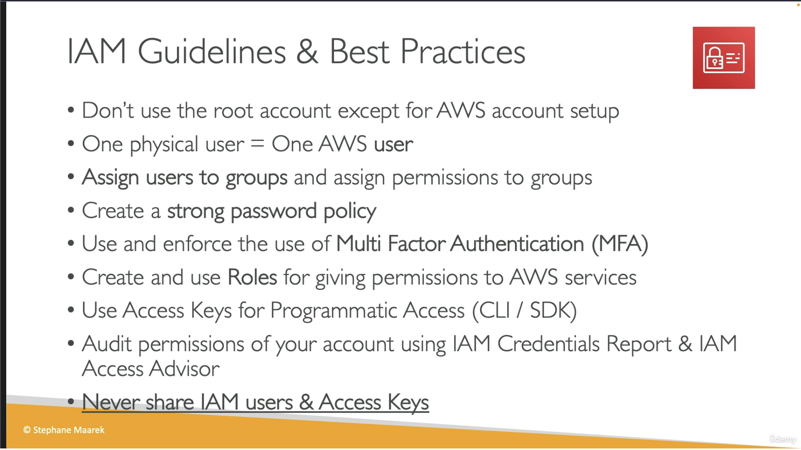
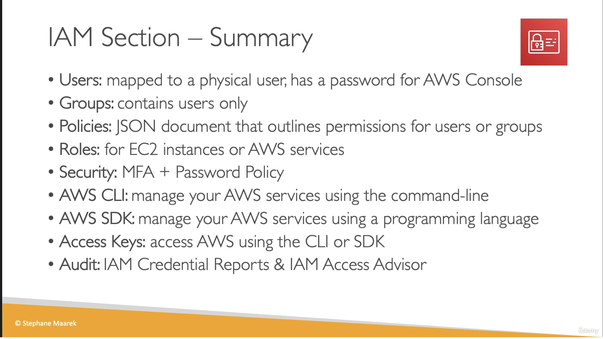

# IAM Best Practices

## Provenance

- Course: Ultimate AWS Certified Developer Associate 2026 DVA-C02
- Section: 4 — IAM and AWS CLI
- Lesson: IAM Best Practices
- Instructor: Stephane Maarek
- Source type: user-provided video transcript and two lesson slides
- Transcript: [raw transcript](../../../../raw/aws/iam/2026-07-28-iam-best-practices.txt)
- Visuals: [guidelines slide](../../../../raw/aws/iam/2026-07-28-iam-guidelines-best-practices-slide.png) and [section-summary slide](../../../../raw/aws/iam/2026-07-28-iam-section-summary-slide.png)
- Ingested: 2026-07-28

## Summary

The lesson consolidates root-user protection, distinct identities, group-based permissions, MFA, service roles, credential security, and access review into an introductory IAM checklist.

Its strongest invariant is that identities and credentials must never be
shared.

The checklist is useful course and exam context, but several statements are
course-level simplifications rather than a current production baseline. In
particular, a root user and an IAM user are identities inside one AWS account,
not two accounts; human access should normally be federated; CLI and SDK access
does not require long-lived IAM-user access keys; and MFA reduces account risk
rather than guaranteeing safety.

## Source Visuals

The first slide presents the lesson checklist and emphasizes never sharing IAM
users or access keys.

The section-summary slide recaps users, groups, policies, roles, MFA, password
policy, CLI and SDK access, access keys, credential reports, and Access Advisor.

## SWE Extraction

### Course checklist

- Avoid routine root-user activity.
- Give each person a distinct identity rather than sharing credentials.
- Group IAM users by responsibility and assign common permissions to groups.
- Configure strong IAM-user password requirements and use MFA.
- Give AWS services permissions through IAM roles.
- Keep programmatic credentials private.
- Use the IAM credential report and last-accessed information to review access.
- Apply least privilege and never share identities or credentials.

### Terminology and current-guidance reconciliation

| Course statement | Production interpretation |
| --- | --- |
| “You should have two accounts, a root account and your personal account.” | One AWS account has an account root user and can contain IAM identities. Root user, IAM user, federated principal, and role session are identities or principals, not separate AWS accounts. |
| Use root only while setting up the account. | Use root credentials only for tasks that require them. Protect root with MFA, do not create root access keys, secure recovery channels, and monitor root activity. AWS Organizations can centrally secure member-account root access and remove member root credentials. |
| One physical user equals one AWS user. | Unique, non-shared identity remains correct. Current AWS guidance prefers federation, commonly through IAM Identity Center, with temporary credentials; a dedicated IAM user is a fallback when federation is unavailable. |
| Users have console passwords and belong to IAM groups. | An IAM user can exist without a console password. IAM groups contain only IAM users; federated workforce access uses the identity provider or Identity Center assignment model instead. |
| Create a strong password policy. | The account IAM password policy applies only to IAM-user console passwords. It does not govern the root password, access keys, or passwords managed by an external identity provider. |
| MFA guarantees a safer account. | Require MFA, and prefer phishing-resistant passkeys or security keys where practical. MFA materially reduces risk but is not a guarantee against account compromise. |
| Create roles for AWS services. | Correct direction, with three authorization surfaces: who can pass the role, which principal the trust policy allows to assume it, and what the role session may do. |
| CLI or SDK use means access keys must be generated. | AWS requests use signing credentials, but the CLI and SDK credential-provider chains can obtain temporary credentials from federation or roles. Long-lived IAM-user access keys are a last-resort fallback, not a prerequisite. |
| Access keys are like passwords. | The secret access key must remain secret. The access key ID is an identifier rather than a password, although it should not be posted without a reason. Temporary credentials also include a session token and expiration. |
| Credential report and Access Advisor audit permissions. | A credential report inventories selected IAM credential state. IAM Last Accessed, called Access Advisor in the course, helps identify permission-review candidates. Neither proves effective permissions or safe removal by itself; corroborate with owner context and CloudTrail. |

### Section-summary boundaries

- Identity-based policies can attach to users, groups, and roles; supported
  resources can also have resource-based policies.
- An IAM user may have a console password, access keys, both, or neither.
- Roles are not limited to EC2 or AWS services; trusted principals can include
  people, workloads, AWS services, and external identities.
- The section summary omits federation, IAM Identity Center, trust policies,
  `iam:PassRole`, temporary credential delivery, policy boundaries, session
  policies, organization guardrails, complete policy evaluation, and audit-log
  validation.

### Evidence map

- Transcript lines 7–13: root-user guidance and the incorrect “two accounts”
  phrasing.
- Transcript lines 15–21: distinct people and non-shared identities.
- Transcript lines 23–29: IAM groups and password policy.
- Transcript lines 31–35: MFA recommendation.
- Transcript lines 37–43: service roles and EC2 example.
- Transcript lines 45–53: CLI, SDK, and access-key handling.
- Transcript lines 55–59: credential report and Access Advisor.
- Transcript lines 61–63: prohibition on sharing IAM users and access keys.
- Guidelines slide: consolidated security checklist.
- Section-summary slide: entity and access-path recap.

## Impacted Pages

- [AWS IAM security baseline](../aws-iam-security-baseline.md)
- [AWS Identity and Access Management (IAM)](../aws-identity-and-access-management.md)
- [Least-privilege access with AWS IAM](../least-privilege-access-with-aws-iam.md)
- [AWS programmatic credential handling](../aws-programmatic-credential-handling.md)
- [Reviewing AWS IAM credentials and permissions](../reviewing-aws-iam-credentials-and-permissions.md)

## Open Questions

- Will a later lesson replace IAM-user console access with IAM Identity Center
  or another federation flow?
- Will the course demonstrate phishing-resistant MFA and root-account recovery
  controls?
- Will it distinguish standalone-account root protection from centralized root
  access for AWS Organizations member accounts?
- Will a hands-on lesson show temporary CLI and SDK credentials before creating
  a long-lived access key?
- Will later material connect credential reports and last-accessed data to
  CloudTrail, IAM Access Analyzer, and organization guardrails?
