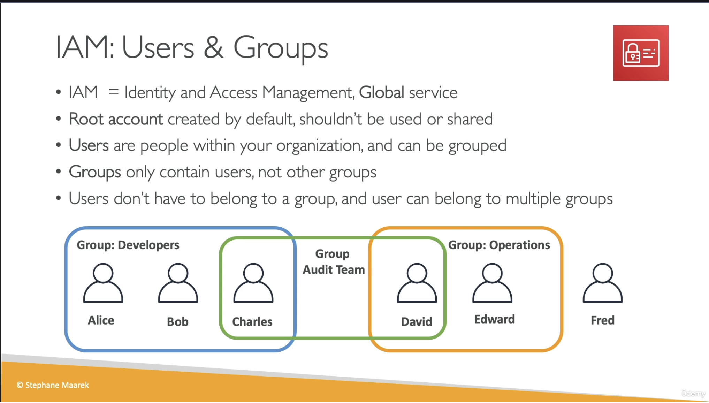
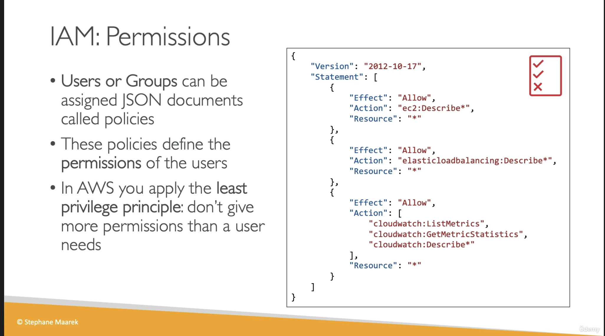

# IAM Introduction: Users, Groups, Policies

## Provenance

- Source: User-provided video transcript and two course slides.
- Course: `Ultimate AWS Certified Developer Associate 2026 DVA-C02`
- Section: `4: IAM & AWS CLI`
- Lesson: `IAM Introduction: Users, Groups, Policies`
- Instructor: Stephane Maarek, identified by the transcript label and slide copyright.
- Assets: [transcript](../../../../raw/aws/iam/2026-07-28-iam-introduction-users-groups-policies.txt), [users and groups slide](../../../../raw/aws/iam/2026-07-28-iam-users-and-groups-slide.png), and [permissions slide](../../../../raw/aws/iam/2026-07-28-iam-permissions-policy-slide.png)
- Ingested: 2026-07-28

## Summary

The lesson introduces AWS IAM users, groups, JSON policies, and least privilege as the basic identity and permission model for an AWS account.

IAM is presented as a global service. The account root user is created with the
account and should be reserved rather than shared or used routinely. IAM users
represent individual people; groups organize users but cannot contain other
groups. A user may belong to no group or to multiple groups.

Policies are JSON permission documents assignable to users or groups. The
example policy allows selected EC2, Elastic Load Balancing, and CloudWatch
read/describe actions. The security rule is to grant only the permissions a
person needs because excessive access creates both security and cost risk.

## Source Visuals





## SWE Extraction

### IAM boundary and account root

- IAM stands for Identity and Access Management and is classified by the course
  as a global AWS service.
- Creating an AWS account creates its root user.
- The course reserves the root user for account setup and says not to share or
  use it for routine work.
- The lesson does not enumerate tasks that require root credentials or cover
  root-user protection controls.

### User and group model

- One IAM user represents one person in the organization.
- A group contains users only; groups cannot contain other groups.
- A user may have zero group memberships, although the source calls an
  ungrouped user not best practice.
- A user may belong to multiple groups, so memberships can compose overlapping
  job responsibilities.
- In the slide example, Alice, Bob, and Charles belong to Developers; David and
  Edward belong to Operations; Charles and David also belong to Audit Team; and
  Fred is ungrouped.

### Permission documents

- A policy is a JSON document that defines allowed behavior for a user or for
  members of a group.
- The slide's policy document uses policy language version `2012-10-17` and a
  `Statement` array.
- Each shown statement has `Effect`, `Action`, and `Resource` fields.
- All three example statements use `"Effect": "Allow"` and
  `"Resource": "*"`.
- The actions are `ec2:Describe*`,
  `elasticloadbalancing:Describe*`, and the CloudWatch actions
  `cloudwatch:ListMetrics`, `cloudwatch:GetMetricStatistics`, and
  `cloudwatch:Describe*`.

The complete policy shown on the permissions slide is:

```json
{
  "Version": "2012-10-17",
  "Statement": [
    {
      "Effect": "Allow",
      "Action": "ec2:Describe*",
      "Resource": "*"
    },
    {
      "Effect": "Allow",
      "Action": "elasticloadbalancing:Describe*",
      "Resource": "*"
    },
    {
      "Effect": "Allow",
      "Action": [
        "cloudwatch:ListMetrics",
        "cloudwatch:GetMetricStatistics",
        "cloudwatch:Describe*"
      ],
      "Resource": "*"
    }
  ]
}
```

This is an instructional example, not a complete production policy review. The
lesson does not explain policy evaluation, explicit deny, conditions, policy
types, or whether individual actions support resource-level scoping.

### Least privilege

- Do not grant every user unrestricted access.
- Grant only the services and actions needed for the person's work.
- Excessive permissions can create security exposure and allow accidental or
  intentional resource creation that incurs cost.
- Group policies provide shared permissions to every user in the group, while
  user policies allow direct assignment.

### Evidence map

- Transcript lines 1–27: IAM scope and root-user guidance.
- Transcript lines 28–91: users, non-nested groups, optional membership, and
  multiple memberships.
- Transcript lines 92–139: policy documents and the example services.
- Transcript lines 140–159: cost/security risk and least privilege.
- Users and groups slide: the six-user, three-group membership topology.
- Permissions slide: policy fields and exact example actions.

## Impacted Pages

- [AWS Identity and Access Management (IAM)](../aws-identity-and-access-management.md)
  — durable service model for users, groups, policies, and the root boundary.
- [Least-privilege access with AWS IAM](../least-privilege-access-with-aws-iam.md)
  — reusable access-design and review practice.
- [AWS global infrastructure and service scope](../../foundations/aws-global-infrastructure.md)
  — adds this lesson as corroborating evidence that IAM is global.

## Open Questions

- What original video URL and publication or update date correspond to this
  lesson?
- How does current AWS guidance compare IAM users with federation or IAM
  Identity Center for human access?
- Which root-user tasks and protections, including MFA, are covered later?
- How do explicit deny, policy evaluation, conditions, roles, and
  resource-based policies extend this introductory model?
