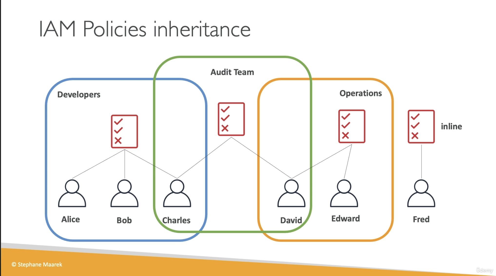
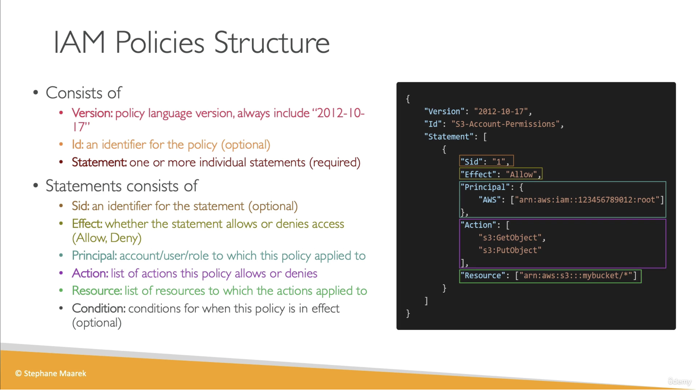

# IAM Policies

## Provenance

- Source: User-provided video transcript and two course slides.
- Course: `Ultimate AWS Certified Developer Associate 2026 DVA-C02`
- Section: `4: IAM and AWS CLI`
- Lesson: `IAM Policies`
- Instructor: Stephane Maarek, identified by the slide copyright.
- Assets: [transcript](../../../../raw/aws/iam/2026-07-28-iam-policies.txt), [policy inheritance slide](../../../../raw/aws/iam/2026-07-28-iam-policy-inheritance-slide.png), and [policy structure slide](../../../../raw/aws/iam/2026-07-28-iam-policy-structure-slide.png)
- Ingested: 2026-07-28

## Summary

The lesson explains how IAM users receive policies through group membership or direct inline attachment and introduces the main elements of an AWS JSON policy document.

A policy attached to a group applies to every user in that group. Users in
multiple groups have the policies associated with each group, while an
ungrouped user can receive a directly embedded inline policy. The example gives
Charles both Developers and Audit Team policies, David both Operations and
Audit Team policies, and Fred an inline policy.

The policy-structure slide introduces top-level `Version`, optional `Id`, and
one or more `Statement` objects. Statement elements include optional `Sid`,
`Effect`, `Principal`, `Action`, `Resource`, and optional `Condition`.

## Source Visuals





## SWE Extraction

### Policy attachment and inheritance

- A policy attached to Developers applies to Alice, Bob, and Charles.
- A different policy attached to Operations applies to David and Edward.
- A policy attached to Audit Team also applies to Charles and David.
- Multiple memberships make multiple group policies applicable to the same
  user: Developers plus Audit Team for Charles, and Operations plus Audit Team
  for David.
- Fred demonstrates a user with no group membership and a directly attached
  inline policy.
- The course uses “inheritance” as shorthand for policies becoming applicable
  through group membership; it does not teach the complete effective-permission
  evaluation algorithm.

### Policy document structure

- `Version` selects the policy language version; the slide uses `2012-10-17`.
- `Id` identifies the policy and is optional.
- `Statement` contains one or more individual policy statements.
- `Sid` identifies a statement and is optional.
- `Effect` is `Allow` or `Deny`.
- `Principal` names the account, user, role, service, or other authenticated
  principal targeted by a resource-based statement.
- `Action` lists the API operations affected by the statement.
- `Resource` lists the resources to which those actions apply.
- `Condition` optionally limits when the statement applies.

The slide's complete example is:

```json
{
  "Version": "2012-10-17",
  "Id": "S3-Account-Permissions",
  "Statement": [
    {
      "Sid": "1",
      "Effect": "Allow",
      "Principal": {
        "AWS": ["arn:aws:iam::123456789012:root"]
      },
      "Action": [
        "s3:GetObject",
        "s3:PutObject"
      ],
      "Resource": ["arn:aws:s3:::mybucket/*"]
    }
  ]
}
```

### Accuracy and terminology notes

- The transcript says “principle,” but the policy element shown on the slide is
  `Principal`.
- The slide combines the general field list with an S3 resource policy example.
  AWS documents that `Principal` is used in resource-based policies and cannot
  appear in an identity-based policy attached to a user, group, or role. For an
  identity-based policy, the attachment supplies the principal implicitly.
  See [AWS JSON policy elements: Principal](https://docs.aws.amazon.com/IAM/latest/UserGuide/reference_policies_elements_principal.html).
- In a resource-based policy, the principal
  `arn:aws:iam::123456789012:root` delegates authority to the AWS account; AWS
  explicitly notes that it does not limit permission to only the account's root
  user.
- The lecture illustrates an inline policy on a user. AWS defines an inline
  policy more generally as embedded one-to-one in a single user, group, or
  role. See [Managed policies and inline policies](https://docs.aws.amazon.com/IAM/latest/UserGuide/access_policies_managed-vs-inline.html).
- Multiple applicable policies do not make every `Allow` unconditional. AWS
  evaluates applicable policy types, and an explicit `Deny` overrides an
  `Allow`. See [Policy evaluation logic](https://docs.aws.amazon.com/IAM/latest/UserGuide/reference_policies_evaluation-logic.html).

### Evidence map

- Transcript lines 1–58: group policy inheritance, multiple memberships, and
  Fred's inline policy.
- Transcript lines 59–92: top-level policy structure, `Version`, `Id`,
  `Statement`, and `Sid`.
- Transcript lines 93–128: `Effect`, `Principal`, `Action`, `Resource`, and
  `Condition`.
- Transcript lines 129–143: exam emphasis and lesson close.
- Inheritance slide: exact user-to-group policy topology.
- Structure slide: element descriptions and complete S3 policy example.

## Impacted Pages

- [AWS Identity and Access Management (IAM)](../aws-identity-and-access-management.md)
  — expands policy attachments, inheritance, document anatomy, policy types,
  and effective evaluation.
- [Least-privilege access with AWS IAM](../least-privilege-access-with-aws-iam.md)
  — adds placement guidance for shared and inline policies plus aggregate-access
  review.

## Open Questions

- Which later lesson distinguishes identity-based, resource-based, managed, and
  inline policies in full?
- How are conditions, permission boundaries, session policies, service control
  policies, and resource control policies evaluated together?
- What hands-on validation or IAM Access Analyzer workflow does the course use
  to test policy documents?
