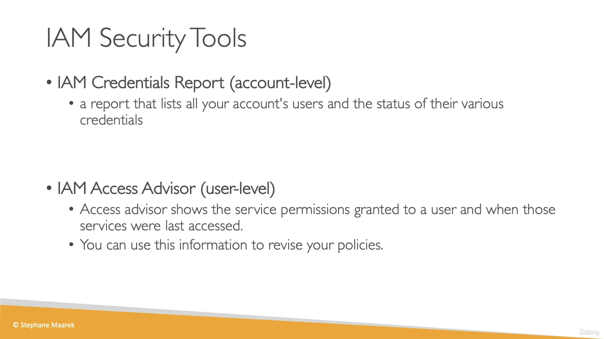

# IAM Security Tools

## Provenance

- Source: User-provided video transcript and one course slide.
- Course: `Ultimate AWS Certified Developer Associate 2026 DVA-C02`
- Section: `4: IAM and AWS CLI`
- Lesson: `IAM Security Tools`
- Instructor: Stephane Maarek, identified by the slide copyright.
- Assets: [transcript](../../../../raw/aws/iam/2026-07-28-iam-security-tools.txt) and [IAM security tools slide](../../../../raw/aws/iam/2026-07-28-iam-security-tools-slide.png)
- Ingested: 2026-07-28

## Summary

The lesson introduces the IAM credential report for account-level credential inventory and IAM Access Advisor for reviewing granted service permissions and last-accessed information.

The downloaded credential-report CSV is demonstrated with root and IAM-user
rows plus password, MFA, access-key, rotation, use, and certificate fields. The
Access Advisor demonstration compares services a user may access with recorded
service use, then drills into a service to identify a policy currently granting
access. The intended outcome is to find credentials requiring attention and
reduce unused permissions toward least privilege.

Both tools provide review evidence rather than automatic security decisions.
Credential reports have a defined IAM-managed-credential scope, and
last-accessed data has tracking, policy-evaluation, and event-semantics
limitations that must be considered before changing access.

## Source Visual

## SWE Extraction

### Course-level tool boundary

| Tool | Course scope | Primary question |
| --- | --- | --- |
| IAM credential report | Account-level CSV | Which IAM users and root credentials exist, and what is their status? |
| IAM Access Advisor | User-level console view | Which services can the user access, when were they last accessed, and which current policy grants access? |

### Credential-report demonstration

- The IAM console generates and downloads a CSV.
- The training-account example contains one root-account row and one IAM-user
  row.
- Demonstrated fields include creation time; password enabled, last used, last
  changed, and next rotation; MFA status; access-key presence, rotation, and
  last-use information; and certificate information.
- The report highlights users whose passwords, keys, MFA status, or inactivity
  deserve review.
- A reported weakness is a signal for investigation; the lesson does not
  demonstrate disabling credentials or deleting users.

### Last-accessed demonstration

- The console displays services that the user is allowed to access.
- The example shows recent access for Organizations, Health, IAM, EC2, and
  Resource Explorer and no tracked access for many other allowed services.
- Drilling into EC2 shows `AdministratorAccess` as a policy currently
  associated with the user's access to that service.
- The proposed use is to identify apparently unused service permissions and
  revise policies toward least privilege.

### Current scope and interpretation notes

- AWS credential reports cover root and IAM-user credentials managed by IAM:
  passwords, the first two access keys, MFA devices, and X.509 signing
  certificates. They do not inventory roles, federated or IAM Identity Center
  identities, service-specific credentials, or every credential type. See
  [credential-report documentation](https://docs.aws.amazon.com/IAM/latest/UserGuide/id_credentials_getting-report.html).
- AWS stores one credential report per account and generates a new one at most
  once every four hours. A download can therefore return the report generated
  within the current four-hour window.
- Current IAM documentation calls the console surface **Last Accessed** and
  supports users, user groups, roles, and managed policies. The course's
  user-level “Access Advisor” description is a valid introductory slice, not
  the complete entity model.
- Last-accessed timestamps describe authenticated **attempts**, including
  denied attempts, rather than only successful use. Recent activity can take
  up to four hours to appear, and tracking coverage varies by service, action,
  and Region. See
  [last-accessed guidance](https://docs.aws.amazon.com/IAM/latest/UserGuide/access_policies_last-accessed.html).
- The report's allowed-service view considers identity permission policies but
  omits other policy types such as resource policies, ACLs, service control
  policies, permissions boundaries, and session policies. `iam:PassRole` is not
  tracked in action-level last-accessed information.
- Do not remove access solely because no use is shown. Confirm the reporting
  period, supported actions, business need, and policy path; use AWS CloudTrail
  as the authoritative record of API calls and success or denial.
- The policies displayed as granting access represent current policy
  associations. They do not prove that the same policy caused a historical
  access attempt.
- IAM Access Advisor or Last Accessed is distinct from **IAM Access Analyzer**,
  which can generate continuous external, internal, or unused-access findings.

### Evidence map

- Transcript lines 1–39: the two tools, their course-level scopes, and
  least-privilege purpose.
- Transcript lines 41–97: credential-report download, fields, root and user
  rows, and security triage.
- Transcript lines 99–143: Access Advisor navigation, accessed and unaccessed
  services, drill-down, and policy attribution.
- Transcript lines 145–151: granular-permission summary and lesson close.
- Course slide: account-level credential report versus user-level Access
  Advisor.

## Impacted Pages

- [Reviewing AWS IAM credentials and permissions](../reviewing-aws-iam-credentials-and-permissions.md)
  — durable account-inventory and evidence-driven permission-review workflow.
- [AWS Identity and Access Management (IAM)](../aws-identity-and-access-management.md)
  — adds security-review telemetry and scope boundaries.
- [AWS programmatic credential handling](../aws-programmatic-credential-handling.md)
  — adds periodic credential inventory and validation before deactivation.
- [Least-privilege access with AWS IAM](../least-privilege-access-with-aws-iam.md)
  — adds a last-accessed-data refinement loop and interpretation safeguards.

## Open Questions

- Does the course later automate credential-report generation and last-accessed
  review through the CLI or API?
- How does the course validate business need and test policy reductions before
  rollout?
- Does later material distinguish Access Advisor or Last Accessed from IAM
  Access Analyzer, CloudTrail, and IAM Access Analyzer unused-access findings?
- What review cadence, ownership model, exception process, and evidence
  retention policy should be used in production?
