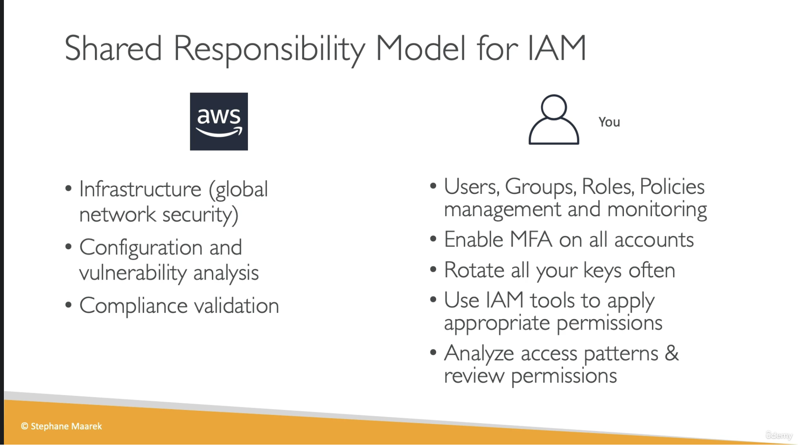

# Shared Responsibility Model for IAM

## Provenance

- Course: Ultimate AWS Certified Developer Associate 2026 DVA-C02
- Section: 4 — IAM and AWS CLI
- Lesson: Shared Responsibility Model for IAM
- Instructor: Stephane Maarek, identified by the slide copyright
- Source type: user-provided video transcript and one lesson slide
- Context note: the transcript mentions the CCP exam even though this lesson was submitted under the DVA-C02 course.
- Assets: [raw transcript](../../../../raw/aws/iam/2026-07-28-shared-responsibility-model-for-iam.txt) and [shared-responsibility slide](../../../../raw/aws/iam/2026-07-28-shared-responsibility-model-for-iam-slide.png)
- Ingested: 2026-07-28

## Summary

The lesson assigns AWS responsibility for the cloud infrastructure and customer responsibility for IAM identities, permissions, MFA, credentials, monitoring, and access review.

This is a useful exam-level division between security **of** the cloud and
security **in** the cloud. Production use needs a more precise,
service-specific boundary: AWS operates IAM and its underlying infrastructure,
while the customer remains accountable for how IAM is configured and used.
Some controls, especially configuration, vulnerability management,
monitoring, and compliance, have separate AWS and customer layers rather than
one exclusive owner.

## Source Visual

The slide places global infrastructure, service configuration and
vulnerability analysis, and compliance validation on the AWS side. It places
IAM resources and policies, MFA, key rotation, permission design, access
analysis, and permission review on the customer side.

## SWE Extraction

### Course-level responsibility split

| AWS in the lesson | Customer in the lesson |
| --- | --- |
| Infrastructure and global network security | Users, groups, roles, and policies |
| Configuration and vulnerability analysis of offered services | Policy management and monitoring |
| Compliance validation for AWS responsibilities | MFA enablement and enforcement |
|  | Key rotation |
|  | Appropriate permissions, access-pattern analysis, and permission review |

### Current-guidance reconciliation

| Course statement | Production interpretation |
| --- | --- |
| AWS is responsible for the infrastructure and global network. | This matches AWS responsibility for security **of** the cloud: the hardware, software, networking, and facilities that run AWS services. |
| AWS owns configuration and vulnerability analysis for its services. | AWS secures and remediates the infrastructure and managed service layers it operates. Customers still configure the services they select and, depending on the service, patch guest operating systems, applications, or customer-controlled service updates. The exact boundary varies by service and deployment model. |
| AWS owns compliance validation. | AWS validates and documents controls for the infrastructure it operates. Customers must determine their own legal and regulatory obligations, map inherited and shared controls, configure workloads, retain evidence, and validate customer-side compliance. Compliance management and verification are shared. |
| Customers create and manage all users, groups, roles, and policies. | Customers own identity architecture, permission requirements, attachments, trust relationships, and lifecycle decisions. AWS can maintain AWS-managed policies or create service-linked roles, but those capabilities do not transfer accountability for the resulting access. Modern workforce access may use IAM Identity Center or an external identity provider instead of IAM users. |
| Customers must enable MFA on all accounts. | MFA is configured for identities, while every AWS account has a root user. Current AWS guidance requires root-user MFA for all account types. Customers still own workforce MFA coverage, identity-provider settings, exception handling, recovery controls, and enforcement policy; IAM Identity Center also supplies MFA defaults. |
| Customers should rotate all keys often. | “Keys” is ambiguous. Prefer temporary credentials that expire and refresh automatically. Remove unused long-lived IAM-user access keys and update remaining keys when needed, after suspected exposure or ownership change, and on any documented risk or compliance schedule. KMS keys, SSH keys, and other key types have separate lifecycles. |
| Customers analyze access and review permissions. | AWS supplies the IAM policy engine, credential reports, last-accessed data, Access Analyzer, and audit events. Customers define required access, configure collection and alerts, interpret evidence, approve remediation, and verify that access remains correct. |

### Durable ownership model

- **AWS supplies and operates capabilities:** IAM service infrastructure,
  authentication and authorization enforcement, managed-service maintenance,
  and AWS-side control evidence.
- **Customers configure and govern their use:** identities, federation, root
  protections, MFA coverage, roles, policies, credentials, monitoring,
  reviews, incident response, and customer-side compliance.
- **Automation does not transfer accountability:** an AWS-managed policy,
  service-linked role, default MFA setting, or analyzer finding still requires
  the customer to decide whether the resulting access and control outcome is
  appropriate.
- **The boundary is service- and control-specific:** inherited, shared, and
  customer-specific controls must be evaluated for the selected service,
  architecture, Region, integration, and regulatory context.

### Evidence map

- Transcript lines 1–17: exam context and purpose of the shared-responsibility
  model.
- Transcript lines 19–31: infrastructure, service security, vulnerability, and
  compliance responsibilities attributed to AWS.
- Transcript lines 33–43: customer ownership of IAM identities, policies,
  management, and monitoring.
- Transcript lines 45–47: customer MFA responsibility.
- Transcript lines 49–51: key-rotation statement.
- Transcript lines 53–63: customer permission design, access analysis, and
  review.
- Transcript lines 65–77: security-of-infrastructure versus use-of-
  infrastructure summary.
- Course slide: side-by-side AWS and customer responsibility checklist.

## Impacted Pages

- [AWS shared responsibility model for IAM](../aws-shared-responsibility-model-for-iam.md)
- [AWS Identity and Access Management (IAM)](../aws-identity-and-access-management.md)
- [AWS IAM security baseline](../aws-iam-security-baseline.md)
- [AWS programmatic credential handling](../aws-programmatic-credential-handling.md)
- [Reviewing AWS IAM credentials and permissions](../reviewing-aws-iam-credentials-and-permissions.md)

## Open Questions

- Is the CCP exam reference reused course material, and should the same
  responsibility matrix be treated as DVA-C02 exam scope?
- Will later course material distinguish inherited, shared, and
  customer-specific controls?
- Will service-specific lessons revisit how the boundary changes between EC2
  and more abstracted managed services?
- Will “keys” be separated into access keys, temporary credentials, KMS keys,
  SSH keys, and signing keys?
- Will the course show how customers evidence IAM control operation through
  CloudTrail, AWS Config, Access Analyzer, Security Hub, or external governance
  systems?
- Will IAM Identity Center, external federation, AWS-managed policies, and
  service-linked roles be incorporated into the customer-ownership model?
