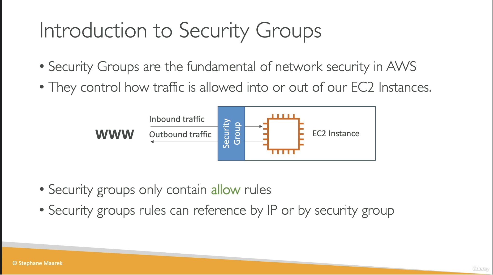
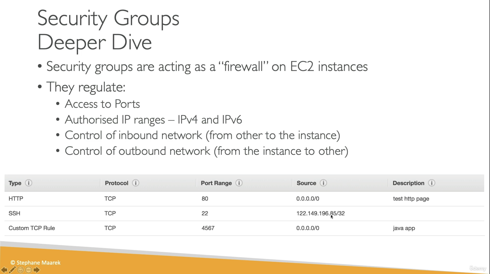
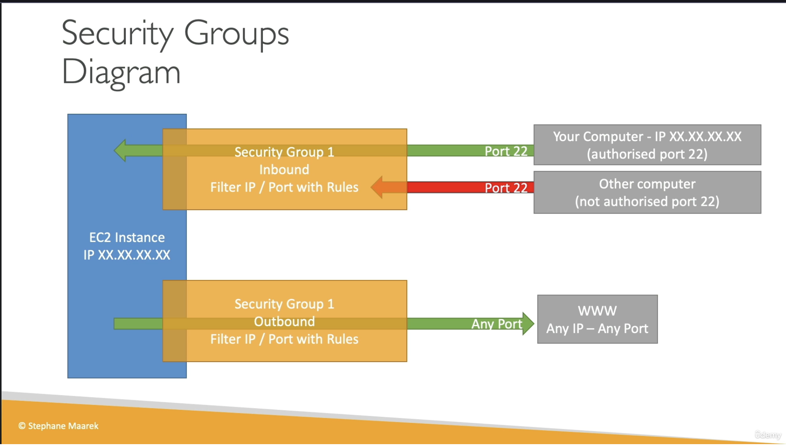
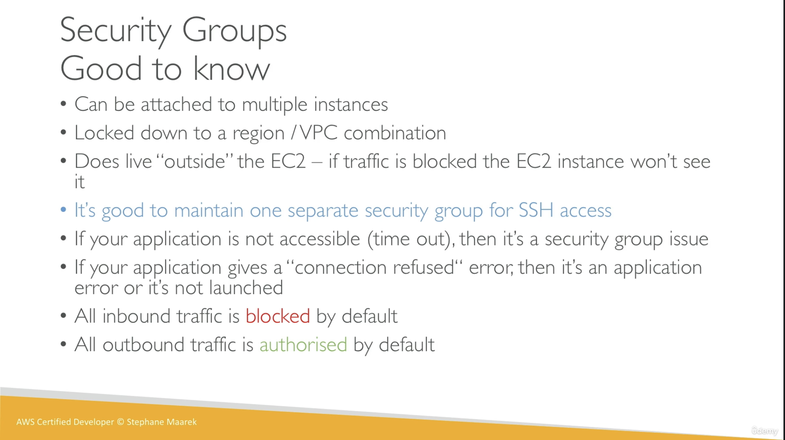
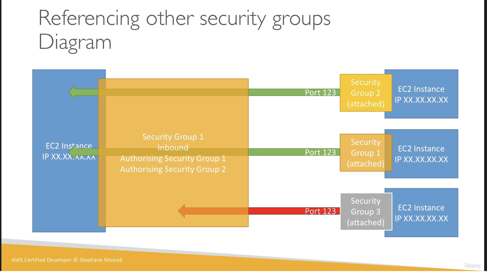
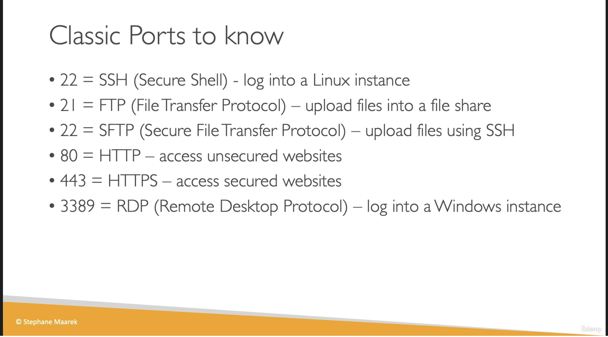

# Security Groups and Classic Ports Overview

## Provenance

- Course: Ultimate AWS Certified Developer Associate 2026 DVA-C02
- Section: 5 — EC2 Fundamentals
- Lesson: Security Groups and Classic Ports Overview
- Instructor and slide copyright: Stephane Maarek
- Source type: user-provided video transcript and six lesson slides
- Transcript: [raw transcript](../../../../../raw/aws/vpc/security-groups/2026-07-30-security-groups-and-classic-ports-overview.txt)
- Visuals: [introduction](../../../../../raw/aws/vpc/security-groups/2026-07-30-security-groups-introduction-slide.png), [deeper dive](../../../../../raw/aws/vpc/security-groups/2026-07-30-security-groups-deeper-dive-slide.png), [traffic diagram](../../../../../raw/aws/vpc/security-groups/2026-07-30-security-groups-traffic-diagram-slide.png), [good to know](../../../../../raw/aws/vpc/security-groups/2026-07-30-security-groups-good-to-know-slide.png), [security-group references](../../../../../raw/aws/vpc/security-groups/2026-07-30-security-group-references-diagram-slide.png), and [classic ports](../../../../../raw/aws/vpc/security-groups/2026-07-30-classic-ports-slide.png)
- Ingested: 2026-07-30
- Current-guidance check: official AWS VPC and EC2 documentation reviewed on 2026-07-30

## Summary

The lesson introduces security groups as allow-list network controls for EC2 ingress and egress, explains CIDR and security-group references, gives basic connectivity diagnostics, and lists common service ports.

The durable model is more precise: security groups are stateful controls
associated with network interfaces; the effective policy is the union of all
associated groups; and a matching allow rule is necessary but not sufficient
for end-to-end reachability.

The course's default-rule and VPC-scope statements need current boundaries.
New custom security groups start with no inbound rules and an allow-all
outbound rule, while a VPC's default security group also allows inbound traffic
from members of itself. Security Group VPC Associations can now make an
eligible non-default group available to multiple VPCs in one Region.

## Source Visuals

The introduction presents security groups as EC2 network firewalls with
inbound and outbound allow rules whose peers can be IP ranges or other security
groups.

The rule table demonstrates protocol, destination port, source CIDR, and
description fields. It includes public HTTP and custom application rules plus
a single-address SSH rule; the wide custom-port example is instructional, not
a least-privilege production default.

The diagram contrasts an authorized SSH source with an unauthorized one and
shows the source-era allow-all egress default. It does not show security-group
statefulness or the other routing and filtering layers required for
reachability.

The slide captures many-to-many attachment, scope, management-access
separation, timeout-versus-refused troubleshooting, and default ingress and
egress. Several bullets are useful heuristics but not exhaustive diagnoses or
current scope contracts.

The diagram shows a target rule accepting a particular port from members of
two groups while not accepting members of a third group. A reference selects
private-IP traffic from associated network interfaces; it does not copy or
inherit the referenced group's rules.

The port mnemonic covers FTP control on 21, SSH and commonly SFTP on 22, HTTP
on 80, HTTPS on 443, and RDP on 3389. These are registered or conventional
defaults, not proof that a service is running or that exposure is safe.

## SWE Extraction

### Rule and attachment model

- Security groups contain allow rules only. Traffic with no matching effective
  rule is dropped; there is no explicit security-group deny rule.
- Inbound rules match a protocol and destination port or range plus a source.
  Outbound rules use a destination instead of a source.
- Sources and destinations can include IPv4 or IPv6 CIDRs, security-group IDs,
  and prefix lists.
- `0.0.0.0/0` means all IPv4 addresses, not all IPv4 and IPv6 traffic.
  `::/0` is the all-IPv6 CIDR. A `/32` identifies one IPv4 address, and a
  `/128` identifies one IPv6 address.
- Security groups are associated with network interfaces. A group can protect
  many interfaces, and an interface can have multiple groups.
- When multiple groups are associated, their rules are aggregated. A
  restrictive group does not override an allow rule in another associated
  group.

### Stateful behavior

- Security groups track connection state. Response traffic for an allowed flow
  can pass regardless of rules in the opposite direction.
- An inbound allow rule does not generally require a matching outbound rule
  solely for the response, and an allowed outbound connection does not require
  a separate inbound rule solely for its response.
- Connection tracking affects how existing flows react to rule changes and has
  finite per-instance allowances. The course does not cover these operational
  details.
- Network ACLs are different: they operate at subnet scope, support allow and
  deny rules, are ordered, and are stateless.

### Defaults

| Context | Initial inbound behavior | Initial outbound behavior |
| --- | --- | --- |
| Newly created custom security group | No inbound rules | One rule allows all outbound traffic; it can be removed or narrowed |
| VPC default security group | Allows all protocols and ports from resources assigned to the same default group | Allows all IPv4 traffic and, for an IPv6-enabled VPC, all IPv6 traffic |

Therefore, “all inbound is blocked and all outbound is allowed by default” is
accurate for a newly created custom group before edits, but not a complete
description of the VPC default security group or of a group after its rules are
changed.

### Security-group references

- A rule that names another security group authorizes traffic in one specified
  direction, protocol, and port range from or to the private IP addresses of
  network interfaces associated with that group.
- Referencing a group does not import its rules and does not automatically
  authorize every port or both initiation directions.
- A self-reference is still an explicit rule. Merely attaching the same group
  to two resources does not, by itself, allow them to communicate.
- References avoid coupling application tiers to changing individual IP
  addresses. A common pattern permits an application tier only from a load
  balancer group and a database tier only from an application group.
- Reference support depends on VPC topology and direction. Same-VPC and peered
  relationships are supported in documented cases; inbound references can
  also work across a transit gateway. Middleboxes can change the address or
  path assumptions, so verify the exact architecture.

### Scope reconciliation

- Security groups remain Region-scoped.
- Historically, a group was used only in the VPC where it was created. Current
  [Security Group VPC Associations](https://docs.aws.amazon.com/vpc/latest/userguide/security-group-assoc.html)
  can associate an eligible group with additional VPCs in the same Region.
- The association feature has constraints: the VPC must be owned or shared,
  default security groups cannot be associated, and default VPCs are excluded.
- Copying or infrastructure-as-code recreation is still required across
  Regions and can remain the appropriate isolation choice across VPCs.

### Management-access practice

- Separating management rules such as SSH or RDP from application rules can
  improve ownership, review, and change control.
- Separation is organizational, not deny precedence. Because associated rules
  are aggregated, another group that broadly permits port 22 or 3389 still
  exposes the interface.
- Do not allow SSH or RDP from `0.0.0.0/0` or `::/0`. Restrict them to the
  required source addresses or private management path.
- Public HTTP or HTTPS CIDRs can be intentional for a public web endpoint.
  Every public rule should still be tied to a documented service requirement.

### Troubleshooting interpretation

| Symptom | What it suggests | What it does not prove |
| --- | --- | --- |
| Timeout or silent hang | A packet or response may be silently dropped, misrouted, or never produced | It is not proof of a security-group problem; routes, internet or NAT gateways, network ACLs, host firewalls, DNS, service health, and asymmetric paths can produce similar symptoms |
| Connection refused | A responding endpoint or intermediary actively rejected the connection | It does not prove the intended application is healthy; the process may not be listening, may be bound to another address, or a host control may reject the port |

Confirm the listener and host firewall, the target network interface and its
aggregated groups, IP version and CIDR, routes and gateways, network ACLs, and
the source-group topology. Use Reachability Analyzer for configured path
analysis and VPC Flow Logs for accepted or rejected flow evidence.

### Classic ports with production caveats

| Default port | Protocol or use | Durable interpretation |
| ---: | --- | --- |
| 21/TCP | FTP | Port 21 carries the FTP control connection; file data uses a separate active or passive data connection. FTP does not provide SSH-style transport security. |
| 22/TCP | SSH; commonly SFTP | SSH commonly provides Linux shell access, and SFTP commonly runs as an SSH subsystem. SFTP is distinct from FTP and FTPS. |
| 80/TCP | HTTP | Default port for an `http` URI without an explicit port. HTTP alone does not provide TLS transport confidentiality or server authentication. |
| 443/TCP | HTTPS | Default port for HTTP over TLS. TLS protects the connection when correctly configured; it does not guarantee that application content or behavior is safe. |
| 3389/TCP and often UDP | RDP | Conventional Windows Remote Desktop service port. Public unrestricted exposure is high risk. |

Applications can listen on other ports, and a registered port does not prove
which process is listening. Security-group rules must match the workload's
actual protocol, destination port, and source or destination.

### Current-guidance reconciliation

| Course statement | Reconciled interpretation |
| --- | --- |
| A security group is a firewall “around” an EC2 instance. | Useful mental model, but the control is associated with a VPC network interface and can protect supported resources beyond EC2. |
| Security groups contain only allow rules. | Correct. Effective rules from all associated groups are aggregated; absence of a matching allow drops the traffic. |
| `0.0.0.0/0` means everything. | It means every IPv4 address. Add `::/0` separately for every IPv6 address. |
| All outbound traffic is authorized by default. | A newly created custom group starts with allow-all egress, but that rule can be removed or narrowed. Response traffic is also affected by stateful connection tracking. |
| All inbound traffic is blocked by default. | A new custom group has no inbound rules. The VPC default group is different: it allows inbound traffic from members of itself. |
| Security groups are locked to a Region/VPC combination. | They remain Region-scoped, but eligible groups can now be associated with multiple VPCs in the same Region under documented constraints. |
| A timeout means the security group is wrong; refused means the application is wrong. | Useful first clue, not a diagnosis. Inspect the entire network path, effective rules, flow evidence, host controls, and listener state. |
| Security-group references eliminate the need to think about IPs. | They remove individual-IP coupling for supported private-IP paths, but still require explicit direction, protocol, port, valid topology, and correct group attachment. |
| SFTP means “secure file transfer protocol.” | SFTP is commonly called the SSH File Transfer Protocol and runs over SSH; it is not FTP with a security toggle. |

### Evidence map

- Transcript lines 1–57 and introduction slide: allow-only ingress and egress
  model plus IP and security-group peers.
- Transcript lines 59–93 and deeper-dive slide: ports, protocols, IPv4 or IPv6,
  CIDRs, and rule fields.
- Transcript lines 95–135 and traffic diagram: allowed SSH source, silent drop,
  and source-era default egress.
- Transcript lines 137–219 and good-to-know slide: attachment cardinality,
  scope, ENI-external filtering, management-group separation, diagnostics, and
  defaults.
- Transcript lines 221–301 and reference diagram: group-to-group rules and
  dynamic instance membership.
- Transcript lines 303–359 and classic-ports slide: FTP, SSH, SFTP, HTTP,
  HTTPS, and RDP port mnemonics.

## Impacted Pages

- [Amazon VPC security groups](../amazon-vpc-security-groups.md) —
  durable rule evaluation, statefulness, references, scope, exposure, ports,
  and troubleshooting guidance.

## Open Questions

- Will the later VPC lesson compare stateful security groups with stateless
  network ACLs and routing boundaries?
- Will the load-balancer lesson implement a load-balancer-to-application
  security-group reference and validate the actual path?
- Will the hands-on use restricted SSH or RDP sources, a private management
  path, VPC Flow Logs, or Reachability Analyzer?
- Will later material cover egress restriction, IPv6 exposure, prefix lists,
  stale references, rule IDs, quotas, and connection-tracking limits?
