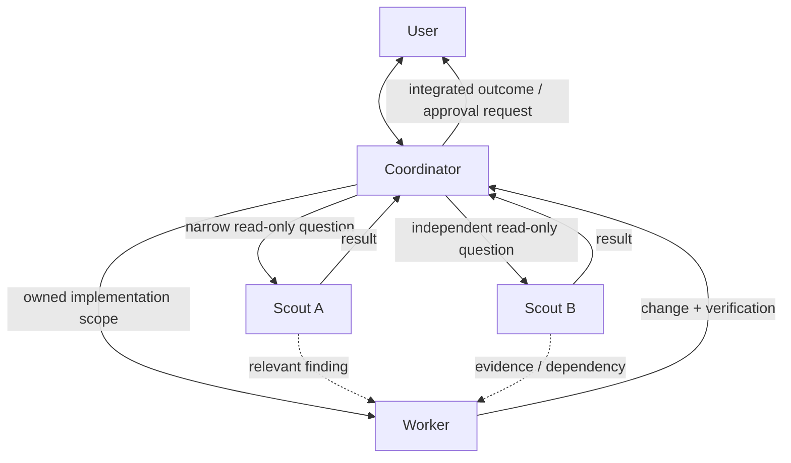

# Multi-agent orchestration blueprint

Use a coordinator and reasoning-matched agents to parallelize independent engineering work while preserving ownership, shared findings, and user control.

## When this shape earns its cost

Use a team when the task contains at least two independent investigations,
clearly separable implementation areas, or ambiguity that benefits from deeper
focused reasoning. Keep work with the coordinator when decomposition and
handoffs would cost more than completing the task directly.

## Roles

| Role         | Default reasoning      | Responsibility                                                                     | Mutation authority          |
| ------------ | ---------------------- | ---------------------------------------------------------------------------------- | --------------------------- |
| Coordinator  | Match the overall task | Decompose, assign, track, integrate, communicate, and retain approvals             | Only as allowed by the user |
| Scout        | Low/light              | Answer one narrow discovery question and cite evidence                             | Read-only                   |
| Worker       | Medium                 | Implement one clearly owned scope and run its checks                               | Limited to assigned scope   |
| Smart worker | High                   | Resolve difficult implementation or ambiguity; coordinate locally only when useful | Limited to assigned scope   |

Prefer one model family and vary reasoning effort first. Reserve the most
expensive coordination mode for high-stakes work with meaningful ambiguity or
scattered context.

## Team topology

Concurrency is a budget, not a target. Count the coordinator in that budget and
use only the agents whose work can proceed independently.

## Assignment protocol

1. State the expected artifact or answer and the evidence needed to accept it.
2. Give the agent one bounded question or exclusive file/module ownership.
3. Select the lowest reasoning tier likely to complete that scope correctly.
4. State whether the assignment is read-only or may mutate its owned scope.
5. Include essential safety, tool, and approval boundaries.
6. State whether the agent may delegate. Leaf agents should be told to complete
   the assignment directly and not spawn other agents.
7. Tell workers that teammates may be active and that they must preserve and
   accommodate others' edits.
8. Ask the agent to send findings directly to a named dependent teammate when
   that shortens the critical path.

Example assignment:

> Trace the request-validation path and identify the smallest change and
> relevant tests. Read only; cite files and line numbers. Start with fresh
> context, do not spawn other agents, and send any API-contract constraint
> directly to the worker responsible for the handler.

## Context inheritance decision

Choose inherited context when the agent needs the broad goal, earlier decisions,
or nuanced constraints already established in the conversation. Choose fresh
context (`fork_turns: "none"` in Codex) when a focused assignment is
self-contained or inherited material would distract the agent.

These choices carry different risks:

- **Inherited context:** may also carry parent-only orchestration instructions.
  Explicitly mark leaf status and delegation limits.
- **Fresh context:** omits task-specific restrictions. Restate every essential
  safety, tool, mutation, and approval boundary in the assignment.

## Coordination loop

1. Assign independent discovery in parallel.
2. Track ownership and stop duplicate investigations.
3. Route discoveries directly to the agent they unblock; keep the coordinator
   informed for integration.
4. Start implementation only with a clear owner and acceptance check.
5. Keep user communication and consequential approvals at the coordinator.
6. Integrate results, resolve inconsistencies, and run proportionate final
   verification.

## Failure modes and controls

- **Over-delegation:** handoff overhead exceeds task work. Use fewer agents or
  keep the task local.
- **Duplicate work:** two agents investigate or edit the same scope. Assign
  explicit questions and exclusive ownership.
- **Context pollution:** inherited history dilutes a narrow task. Use fresh
  context with a complete bounded prompt.
- **Missing boundaries:** a fresh agent does not know safety or tool limits.
  Repeat the restrictions in its assignment.
- **Delegation explosion:** inherited orchestration guidance causes leaf agents
  to spawn unnecessary teams. Explicitly prohibit further delegation.
- **Premature mutation:** discovery changes state before the approach is known.
  Keep scouts read-only.
- **Approval drift:** agents perform consequential actions without the user.
  Retain approvals at the coordinator.
- **Reasoning overspend:** every subtask gets maximum effort. Match effort to
  uncertainty and evaluate progress relative to cost.

## Verification

- Every agent had a distinct accepted outcome or owned scope.
- Read-only scouts did not mutate state.
- Required restrictions survived fresh or inherited context.
- Cross-agent findings reached the teammates that depended on them.
- The coordinator integrated results and checked for contradictions.
- Tests or other acceptance checks cover each changed scope.
- The user retained control over consequential approvals.

## Source

Synthesized from
[Practical multi-agent orchestration in Codex](sources/2026-07-27-practical-multi-agent-orchestration-in-codex.md).
