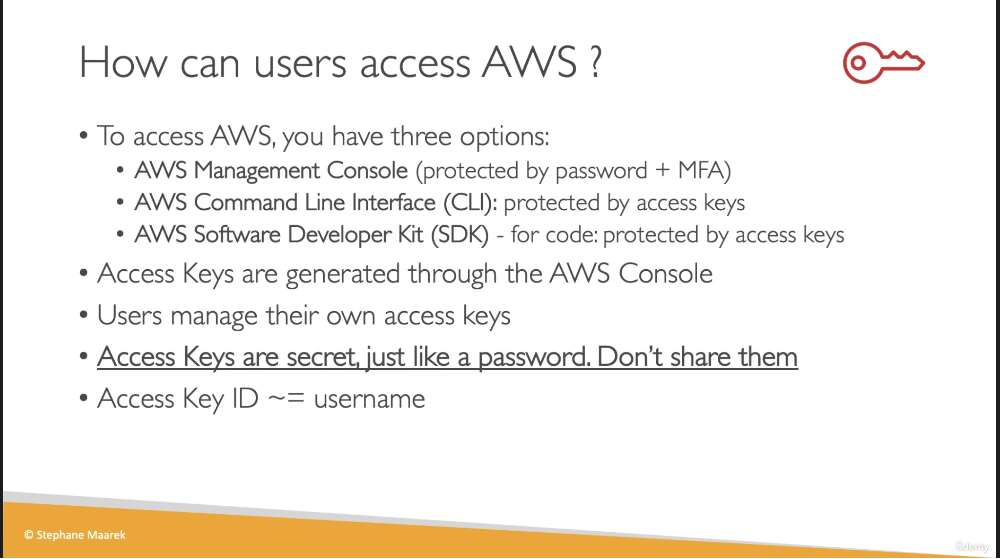

# AWS Access Keys, CLI and SDK

## Provenance

- Source: User-provided video transcript and one course slide.
- Course: `Ultimate AWS Certified Developer Associate 2026 DVA-C02`
- Section: `4: IAM and AWS CLI`
- Lesson: `AWS Access Keys, CLI and SDK`
- Instructor: Stephane Maarek, identified by the slide copyright.
- Assets: [transcript](../../raw/2026-07-28-aws-access-keys-cli-and-sdk.txt) and [access methods slide](../../raw/2026-07-28-aws-access-methods-slide.png)
- Ingested: 2026-07-28

## Summary

The lesson distinguishes AWS console, CLI, and SDK access, introduces IAM-user access key pairs, and explains CLI scripting and SDK embedding.

The Management Console is the browser interface. The AWS CLI sends commands
from a shell and supports scripting and automation. AWS SDKs are
language-specific libraries embedded in application code. The course configures
the CLI and SDK with an access key ID and secret access key created in the IAM
console, emphasizes that credentials are user-specific, and warns never to
share them.

The three-interface model remains useful, but the authentication model is
introductory. Current AWS guidance prefers temporary credentials and credential
provider chains over long-lived IAM-user access keys for both humans and
workloads.

## Source Visual

## SWE Extraction

### AWS access surfaces

| Surface | Course-level use | Interaction style |
| --- | --- | --- |
| AWS Management Console | Browser-based resource administration | Interactive web interface |
| AWS Command Line Interface (CLI) | Service access, scripts, and task automation | Shell commands such as `aws s3 cp` |
| AWS Software Development Kit (SDK) | Service API access from an application | Language-specific libraries embedded in code |

- The CLI calls AWS service APIs and is an open-source alternative to the
  console.
- CLI commands begin with `aws`; command output can feed shell scripts and
  automation.
- SDKs expose programmatic service clients inside applications rather than as
  terminal commands.
- The course names JavaScript, Python, PHP, .NET, Ruby, Java, Go, Node.js, and
  C++ plus mobile and IoT SDKs. Treat this as a source-era example list because
  supported languages and versions change.

### Course access-key workflow

- An IAM-user access key consists of an access key ID and secret access key.
- The course compares the access key ID to a username and the secret access key
  to a password.
- A user creates the pair in the IAM console and receives the opportunity to
  view or download it at creation.
- The pair can configure CLI or SDK requests to AWS service APIs.
- Credentials belong to the identity that created them; colleagues should
  generate their own credentials rather than share one pair.
- The sample credentials shown in the course are fake.

### CLI and SDK relationship

- The CLI is for interactive shell use and automation; an SDK is for
  application code.
- Both ultimately send authenticated requests to AWS service APIs.
- The course says the CLI is built on the Python SDK “Boto.” Current Boto3
  documentation states the more precise relationship: Botocore supplies
  low-level functionality shared by Boto3 and the AWS CLI. See the
  [Boto3 quickstart](https://docs.aws.amazon.com/boto3/latest/guide/quickstart.html).

### Current security and authentication notes

- CLI and SDK authentication is not limited to long-lived IAM-user access keys.
  AWS tools and SDKs use credential provider chains that can discover console
  login, IAM Identity Center, assume-role, web-identity, container, instance
  metadata, process, and access-key providers. See
  [standardized credential providers](https://docs.aws.amazon.com/sdkref/latest/guide/standardized-credentials.html).
- AWS recommends temporary credentials for human users through federation or
  IAM Identity Center and temporary role credentials for workloads. Long-lived
  IAM-user access keys are a fallback for use cases that cannot use roles or
  federation. See [IAM security best practices](https://docs.aws.amazon.com/IAM/latest/UserGuide/best-practices.html).
- Temporary credentials also contain an access key ID and secret access key,
  plus a session token and expiration.
- The secret access key is available only when the key is created. If it is
  lost, replace the access key rather than attempting recovery. See
  [`create-access-key`](https://docs.aws.amazon.com/cli/latest/reference/iam/create-access-key.html).
- The access key ID identifies the credential, while the secret access key
  signs requests. The course's username/password analogy communicates their
  roles but should not be treated as a complete credential-handling model.
- Do not create root-user access keys for ordinary CLI or SDK use.

### Evidence map

- Transcript lines 1–40: console, CLI, and SDK access surfaces.
- Transcript lines 41–92: IAM-user access-key creation, components, and
  non-sharing guidance.
- Transcript lines 93–136: CLI commands, APIs, automation, and open-source
  status.
- Transcript lines 137–188: SDK purpose, language examples, mobile/IoT use, and
  the Python relationship.
- Transcript lines 189–195: transition to the hands-on setup lesson.
- Course slide: concise comparison of the three surfaces and access-key
  handling.

## Impacted Pages

- [AWS programmatic access: CLI and SDKs](../systems/aws-programmatic-access-cli-and-sdks.md)
  — durable tool boundaries, API flow, and credential-provider model.
- [AWS programmatic credential handling](../practices/aws-programmatic-credential-handling.md)
  — temporary-first credential selection and long-lived-key safeguards.
- [AWS Identity and Access Management (IAM)](../systems/aws-identity-and-access-management.md)
  — adds IAM access-key and temporary-credential boundaries.

## Open Questions

- Which authentication method does the next hands-on lesson configure, and is
  it intended only for a disposable learning environment?
- Which AWS CLI major version does the course use?
- When does the course introduce IAM Identity Center, roles, temporary
  credentials, profiles, and credential-provider precedence?
- How does the course handle rotation, revocation, exposure response, and
  detection of unused access keys?
