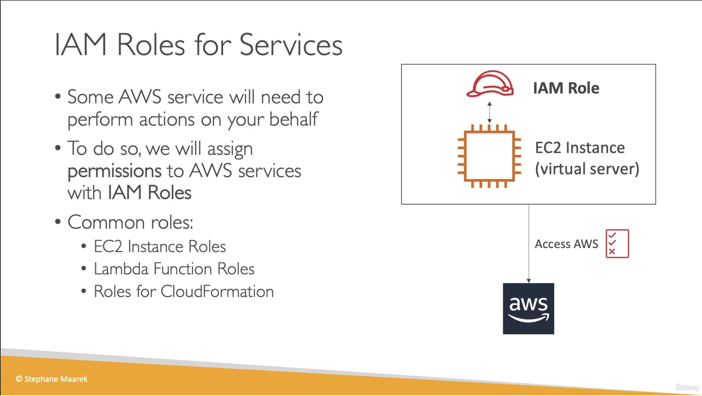

# IAM Roles for AWS Services

## Provenance

- Source: User-provided video transcript and one course slide.
- Course: `Ultimate AWS Certified Developer Associate 2026 DVA-C02`
- Section: `4: IAM and AWS CLI`
- Lesson: `IAM Roles for AWS Services`
- Instructor: Stephane Maarek, identified by the slide copyright.
- Assets: [transcript](../../raw/2026-07-28-iam-roles-for-aws-services.txt) and [IAM roles for services slide](../../raw/2026-07-28-iam-roles-for-services-slide.png)
- Ingested: 2026-07-28

## Summary

The lesson introduces IAM roles as the mechanism that lets AWS services perform authorized actions in an AWS account.

Its central example associates a role with an EC2 instance so software on the
instance can call AWS APIs under the role's permissions. Lambda execution roles
and CloudFormation roles are named as other common examples.

The course's “role is like a user” analogy is useful only at a high level. Both
are IAM identities with permission policies, but a role is assumed by a trusted
principal, has no standard long-lived password or access keys, and supplies
temporary credentials for a role session.

## Source Visual

## SWE Extraction

### Course model

- Some AWS services must call other AWS APIs on behalf of an account or
  workload.
- An IAM role supplies the permissions used for those calls.
- The EC2 example gives an instance permission to access AWS through an
  associated role.
- The lesson also names Lambda function roles and CloudFormation roles.
- The following hands-on lecture creates a role; this lesson does not configure
  or test one.

### Complete role authorization model

An IAM role separates two questions:

1. **Who may assume it?** A required role trust policy names trusted principals
   such as an AWS service and permits an appropriate AWS STS assume-role action.
2. **What may a resulting role session do?** Permission policies attached to
   the role constrain AWS API actions, resources, and conditions.

When an AWS service assumes the role, AWS issues temporary security credentials
for a role session. The service or workload uses those credentials to sign API
requests. The role itself has no standard long-lived credentials.

Configuring a service to use a role also requires the configuring principal to
be authorized to pass the approved role, commonly through `iam:PassRole`. That
authorization does not grant the principal the role's runtime permissions; it
controls which role the principal can associate with a service.

### Service-specific delivery

| Course example | Current AWS mechanism |
| --- | --- |
| EC2 instance role | EC2 uses an instance profile as the container that delivers one role to an instance. SDKs and the CLI can retrieve automatically rotated temporary role credentials from instance metadata. |
| Lambda function role | Lambda assumes the function's execution role when it invokes the function. The role grants logging and any additional AWS API permissions needed by the function. |
| CloudFormation role | A CloudFormation service role lets CloudFormation create, update, or delete stack resources. The role trust policy names `cloudformation.amazonaws.com`, and the caller needs permission to pass the role. |

### Accuracy and terminology notes

- A role is an IAM identity, but it is not tied to one physical person and does
  not carry a permanent password or access-key pair. See
  [IAM roles](https://docs.aws.amazon.com/IAM/latest/UserGuide/id_roles.html).
- The slide visually combines an EC2 instance and role. They remain distinct
  resources: EC2 associates the instance with an instance profile that contains
  the role. The same role can be used by multiple instances, while one instance
  can have only one role association at a time. See
  [IAM roles for Amazon EC2](https://docs.aws.amazon.com/AWSEC2/latest/UserGuide/iam-roles-for-amazon-ec2.html).
- Applications on EC2 should let the SDK credential provider obtain and refresh
  temporary credentials rather than storing long-lived credentials on the
  instance.
- A service role is assumed by a service and can be created and managed by an
  IAM administrator. A service-linked role is a service-owned subtype whose
  permissions are predefined by the linked service; the lesson does not make
  this distinction.
- A role's trust policy and permission policies are different controls. A
  permissive trust policy or overly broad `iam:PassRole` authorization can
  create a privilege-escalation path even when the role's own permissions are
  otherwise intentional.

### Evidence map

- Transcript lines 1–29: IAM roles and AWS services acting on an account's
  behalf.
- Transcript lines 35–65: EC2 instance example and permission-controlled API
  access.
- Transcript lines 67–75: EC2, Lambda, and CloudFormation examples.
- Transcript lines 77–85: scope boundary and transition to role creation.
- Course slide: concise service-role purpose, EC2 association, and named
  examples.

## Impacted Pages

- [AWS IAM roles for services](../concepts/aws-iam-roles-for-services.md)
  — durable trust, permission, assumption, temporary-credential, and
  service-specific model.
- [AWS Identity and Access Management (IAM)](../systems/aws-identity-and-access-management.md)
  — adds roles to the IAM identity and policy model.
- [AWS programmatic credential handling](../practices/aws-programmatic-credential-handling.md)
  — connects workload roles to automatically refreshed temporary credentials.
- [Least-privilege access with AWS IAM](../practices/least-privilege-access-with-aws-iam.md)
  — adds service-role trust and `iam:PassRole` review guidance.
- [AWS programmatic access: CLI and SDKs](../systems/aws-programmatic-access-cli-and-sdks.md)
  — cross-links runtime role credentials with SDK and CLI provider chains.

## Open Questions

- How does the hands-on lecture configure the service principal, permission
  policies, and role name?
- Does the course explicitly distinguish trust policies from permission
  policies and show AWS STS role sessions?
- When does the course introduce instance profiles, Lambda execution roles,
  CloudFormation service roles, service-linked roles, and `iam:PassRole`?
- Which examples test role permissions, credential refresh, and denial paths?
