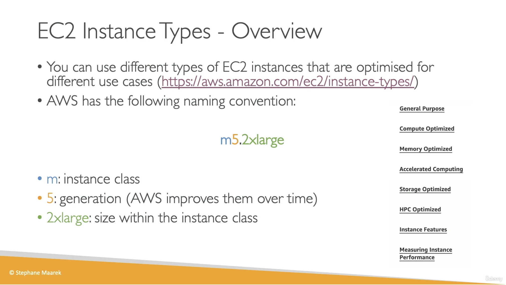
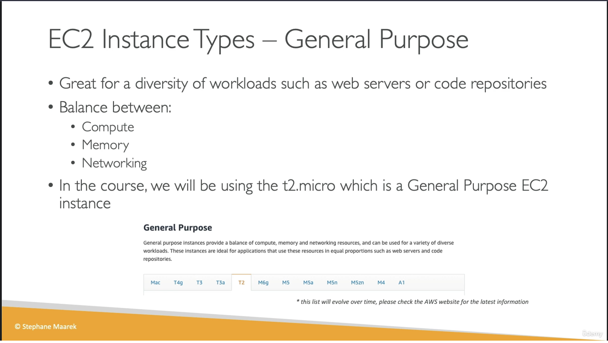
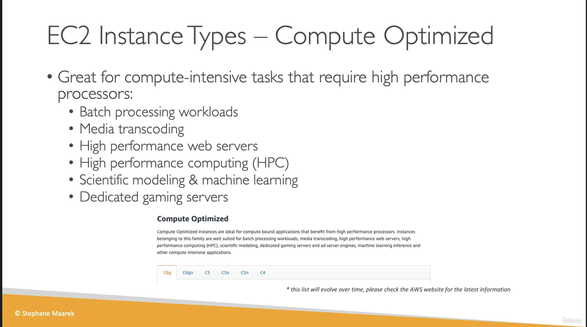
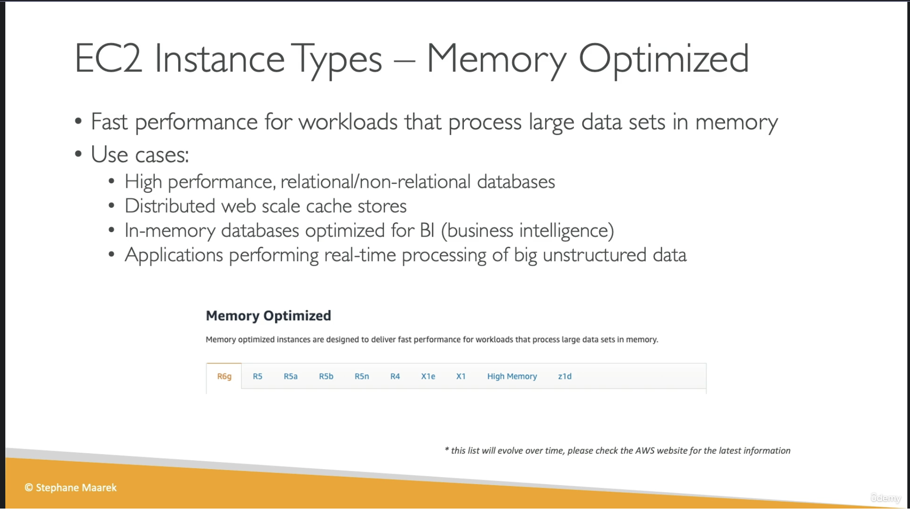
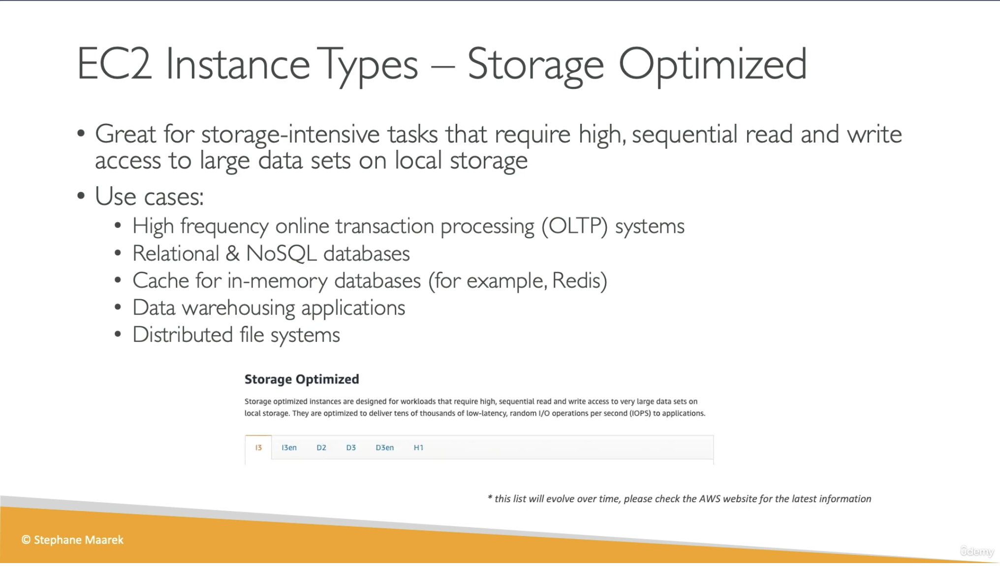

# EC2 Instance Types Basics

## Provenance

- Course: Ultimate AWS Certified Developer Associate 2026 DVA-C02
- Section: 5 — EC2 Fundamentals
- Lesson: EC2 Instance Types Basics
- Instructor and slide copyright: Stephane Maarek
- Source type: user-provided video transcript and five lesson slides
- Transcript: [raw transcript](../../raw/2026-07-30-ec2-instance-types-basics.txt)
- Visuals: [overview](../../raw/2026-07-30-ec2-instance-types-overview-slide.png), [general purpose](../../raw/2026-07-30-ec2-instance-types-general-purpose-slide.png), [compute optimized](../../raw/2026-07-30-ec2-instance-types-compute-optimized-slide.png), [memory optimized](../../raw/2026-07-30-ec2-instance-types-memory-optimized-slide.png), and [storage optimized](../../raw/2026-07-30-ec2-instance-types-storage-optimized-slide.png)
- Ingested: 2026-07-30
- Current-guidance check: official AWS EC2 documentation reviewed on 2026-07-30

## Summary

The lesson introduces EC2 instance-type naming, workload-oriented categories, and the resource tradeoffs among general-purpose, compute-optimized, memory-optimized, and storage-optimized instances.

Its durable lesson is to choose an instance type from the workload's dominant
resource requirements, then compare the exact CPU, memory, network, EBS, local
storage, and price characteristics of candidate types.

The family lists and Free Tier statement are time-sensitive. The transcript
also contains two specification errors: the correct identifier is
`c5d.4xlarge`, not `c5.d.4xlarge`, and AWS documents `r5.16xlarge` with 64
vCPUs rather than 16. Current AWS documentation, regional availability, and
pricing are authoritative for implementation.

## Source Visuals

The overview slide correctly renders `m5.2xlarge` and decomposes it into an
instance class, generation, and size. Its navigation shows six workload
categories—general purpose, compute optimized, memory optimized, accelerated
computing, storage optimized, and HPC optimized—plus separate feature and
performance topics.

The general-purpose slide emphasizes a balance of compute, memory, and
networking for varied workloads such as web servers and code repositories. Its
family strip and `t2.micro` course choice are source-era snapshots.

The compute-optimized slide associates high-performance processors with batch
processing, media transcoding, high-performance web serving, HPC, scientific
modeling or machine learning, and dedicated game servers.

The memory-optimized slide focuses on large in-memory data sets, databases,
distributed caches, business intelligence, and real-time processing.

The storage-optimized slide focuses on high sequential throughput and
low-latency random I/O against large local data sets. The named OLTP, database,
cache, warehouse, and distributed-file-system use cases still require a
durability design because EC2 instance store is not persistent storage.

## SWE Extraction

### Instance-type naming

- The valid course example is `m5.2xlarge`; the spoken
  `m5.2xlarge.instance` is not an EC2 instance-type identifier.
- In the simplified example, `m` is the general-purpose series, `5` is the
  generation, and `2xlarge` is the size.
- Current AWS naming is richer than the three-part course model. A family may
  include option letters after its generation—for example, `c7gn`—and the
  value after the period is the size, including `metal` for bare metal.
- Larger sizes within a family usually add capacity, but code and
  infrastructure configuration must use the published specification rather
  than infer vCPU, memory, network, EBS, or instance-store values from the
  label alone.

### Workload categories

| Category taught or shown | Resource emphasis | Course examples | Source-era identifiers |
| --- | --- | --- | --- |
| General purpose | Balance of compute, memory, and networking | Web servers, code repositories, varied workloads | `T2`, `M5`, and other families shown on the slide |
| Compute optimized | Processor performance | Batch processing, media transcoding, high-performance web servers, HPC, machine learning, game servers | `C5`, `C6` |
| Memory optimized | RAM capacity and throughput for large in-memory data sets | Relational and non-relational databases, distributed caches, BI, real-time unstructured-data processing | `R`, `X1`, High Memory, `Z1` |
| Storage optimized | High-throughput and low-latency access to large local data sets | OLTP, databases, Redis cache, data warehouses, distributed file systems | `I`, `D`, `H1` |
| Accelerated computing | Listed on the overview slide but not explained in the transcript | Not covered | Not covered |
| HPC optimized | Listed separately on the overview slide; HPC is also mentioned under compute-intensive uses | HPC workloads | Not covered |

These are workload-entry points, not complete selection rules. The category
does not replace compatibility checks, exact specifications, regional
availability, storage semantics, benchmarking, or cost analysis.

### Current-guidance reconciliation

| Course statement | Reconciled interpretation |
| --- | --- |
| AWS has “seven different types.” | The source is internally ambiguous: its overview slide displays six workload categories and two additional navigation topics. The [current AWS EC2 instance-types page](https://aws.amazon.com/ec2/instance-types/) lists six categories as of 2026-07-30. Treat category counts as mutable navigation, not an exam invariant. |
| `m5.2xlarge.instance` | The slide and [AWS general-purpose specifications](https://docs.aws.amazon.com/ec2/latest/instancetypes/gp.html) use `m5.2xlarge`; `.instance` is not part of the identifier. |
| Instance names consist only of class, generation, and size. | The course model is a useful first approximation. The [AWS naming reference](https://docs.aws.amazon.com/ec2/latest/instancetypes/instance-type-names.html) also defines series and option letters such as processor, local-storage, network, EBS, and other variants. |
| `t2.micro` is “the free tier” instance. | Eligibility depends on account creation date and current program terms. The [EC2 Free Tier documentation](https://docs.aws.amazon.com/AWSEC2/latest/UserGuide/ec2-free-tier-usage.html) lists different eligible types for accounts created before versus on or after 2025-07-15. Verify the console or API instead of hard-coding `t2.micro`. |
| `r5.16xlarge` has 16 vCPUs and 512 GB of memory. | [AWS memory-optimized specifications](https://docs.aws.amazon.com/ec2/latest/instancetypes/mo.html) list 64 vCPUs and 512 GiB. The 16-vCPU value in the transcript is incorrect. |
| `c5.d.4xlarge` has 16 vCPUs and 32 GB of memory. | The correct identifier is `c5d.4xlarge`; [AWS compute-optimized specifications](https://docs.aws.amazon.com/ec2/latest/instancetypes/co.html) list 16 vCPUs and 32 GiB. The `d` option denotes instance-store volumes. |
| Static slides or a comparison website can enumerate all families and prices. | Family availability, generation status, specifications, and prices evolve. A third-party comparison site can aid exploration, but AWS documentation, regional APIs, and AWS pricing are the deployment sources of truth. |

### Engineering implications

- Start with the measured bottleneck—balanced, CPU, memory, accelerator, local
  I/O, or tightly coupled HPC—rather than a familiar family name.
- Distinguish EBS performance from instance-store performance. A storage-
  optimized label does not make local data durable.
- Account for burst behavior. `T` instances use CPU credits and are not
  equivalent to fixed-performance families under sustained CPU load.
- Verify processor architecture and operating-system or AMI compatibility
  before switching among Intel, AMD, AWS Graviton, Mac, or accelerator-backed
  families.
- Compare candidates at the exact type and Region, then benchmark with a
  representative workload and right-size using observed utilization.

### Evidence map

- Transcript lines 5–45: workload-specific optimization, categories, families,
  and AWS reference material.
- Transcript lines 47–85 and overview slide: simplified `m5.2xlarge` naming and
  size interpretation.
- Transcript lines 95–127 and general-purpose slide: balanced resources,
  example workloads, `t2.micro`, and mutable family lists.
- Transcript lines 129–163 and compute-optimized slide: CPU-intensive
  workloads and `C` families.
- Transcript lines 165–203 and memory-optimized slide: in-memory workloads and
  `R`, `X`, High Memory, and `Z` examples.
- Transcript lines 205–239 and storage-optimized slide: local-storage
  workloads and `I`, `D`, and `H` examples.
- Transcript lines 241–267: resource comparison and the erroneous
  `r5.16xlarge` vCPU count and `c5.d.4xlarge` spelling.
- Transcript lines 269–307: third-party comparison-site workflow and pricing
  fields.

## Impacted Pages

- [Amazon EC2 instance types](../systems/amazon-ec2-instance-types.md) —
  durable naming, taxonomy, selection, performance, storage, and staleness
  guidance.

## Open Questions

- What are the original video URL and publication or update date?
- Which account-creation path will the course use for its `t2.micro` hands-on,
  given the Free Tier program change on 2025-07-15?
- Will later lessons distinguish instance store from EBS and design for loss of
  local instance-store data?
- Will later material cover accelerated-computing and HPC families separately,
  benchmark candidate types, and use utilization evidence for right-sizing?
