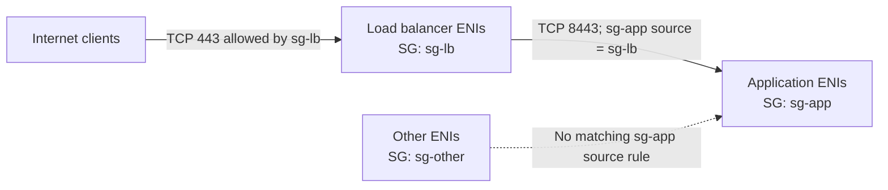

# Amazon VPC security groups

An Amazon VPC security group is a stateful, allow-list network control associated with one or more network interfaces.

It filters traffic for EC2 and other supported VPC resources, but it is only
one layer in an end-to-end path. Routing, gateways, network ACLs, host
firewalls, listeners, DNS, and application health can independently permit or
prevent connectivity.

## Evaluation model

- Security groups support allow rules, not explicit deny rules.
- Inbound rules describe allowed sources; outbound rules describe allowed
  destinations.
- TCP and UDP rules normally match protocol, destination port or range, and a
  peer expressed as an IPv4 CIDR, IPv6 CIDR, security group, or prefix list.
- All rules from every group associated with a network interface are
  aggregated. If any effective rule allows the flow, another associated group
  cannot deny it.
- Traffic with no matching effective allow is dropped.
- Rule order does not define precedence.

Source: [AWS security-group rules](https://docs.aws.amazon.com/vpc/latest/userguide/security-group-rules.html).

## Stateful connection tracking

Security groups track flow state. When an inbound flow is allowed, its response
can leave regardless of outbound rules; when an outbound flow is allowed, its
response can enter regardless of inbound rules.

This does not mean every bidirectional initiation is allowed. Each new flow
still needs an applicable rule in its initiating direction. Connection
tracking also has finite allowances, idle timeouts, automatically tracked
traffic, and cases where broad two-way rules produce untracked flows.

Source: [EC2 security-group connection tracking](https://docs.aws.amazon.com/AWSEC2/latest/UserGuide/security-group-connection-tracking.html).

## Attachment and scope

- Security groups are associated with network interfaces, not with individual
  IP addresses. Every address on an interface is subject to its effective
  groups.
- One group can be associated with many interfaces. One interface can have
  multiple groups, subject to service quotas.
- Changing a group's rules affects every associated resource.
- Security groups are Region-scoped.
- A group is created for a VPC. Security Group VPC Associations can make an
  eligible non-default group available in additional VPCs in the same Region.
  The feature excludes default groups and default VPCs and has ownership or
  sharing requirements.
- Cross-Region reuse still requires separate resources, commonly managed
  through infrastructure as code.

Sources: [changing EC2 security groups](https://docs.aws.amazon.com/AWSEC2/latest/UserGuide/changing-security-group.html)
and [Security Group VPC Associations](https://docs.aws.amazon.com/vpc/latest/userguide/security-group-assoc.html).

## Initial and default-group rules

| Group context | Inbound | Outbound |
| --- | --- | --- |
| New custom group | No rules, so no new inbound flow is allowed | Allow all traffic until the rule is removed or narrowed |
| VPC default group | Allow all protocols and ports from network interfaces assigned to the same default group | Allow all IPv4 traffic and, in an IPv6-enabled VPC, all IPv6 traffic |

Prefer purpose-specific groups over relying on the default group. Defaults are
starting configurations, not immutable platform behavior.

Source: [VPC default security groups](https://docs.aws.amazon.com/vpc/latest/userguide/default-security-group.html).

## CIDR boundaries

| CIDR | Meaning |
| --- | --- |
| `0.0.0.0/0` | Every IPv4 address |
| `::/0` | Every IPv6 address |
| `203.0.113.10/32` | One documentation-example IPv4 address |
| `2001:db8::1/128` | One documentation-example IPv6 address |

IPv4 and IPv6 rules are separate. An IPv4-only restriction does not constrain
an IPv6 path, and vice versa.

## Security-group references

Use a security-group ID as a peer when access should follow workload
membership rather than individual IP addresses.

The `sg-app` inbound rule in this example matches private-IP traffic from
network interfaces associated with `sg-lb`, on the stated protocol and port.
It does not copy `sg-lb` rules, authorize `sg-other`, or create unrestricted
bidirectional initiation.

Self-referencing a group can allow member interfaces to initiate flows to one
another on specified ports. Simply sharing a group without a self-referencing
rule does not grant that access.

References require a supported topology. AWS documents same-VPC and VPC-peering
cases, inbound references across a transit gateway, and limitations when
traffic traverses a middlebox.

Source: [AWS security-group referencing](https://docs.aws.amazon.com/vpc/latest/userguide/security-group-rules.html#security-group-referencing).

## Least-privilege patterns

- Express each rule as a documented source, protocol, destination port, owner,
  purpose, and review or expiry condition.
- For a public web service, internet ingress to ports 80 and 443 may be
  intentional; avoid exposing unrelated ports.
- Never use `0.0.0.0/0` or `::/0` for SSH port 22 or RDP port 3389. Restrict
  management access to required networks or a private management path.
- Separate management rules from application rules when that improves
  ownership and auditability, but remember that groups are additive.
- Reference a load balancer group from the application group rather than
  allowing the whole VPC or internet.
- Reference the application group from the database group rather than
  maintaining changing application-instance IPs.
- Review allow-all egress instead of assuming it matches every threat model or
  compliance boundary.
- Remove unused and stale groups or references, and monitor rule changes.

AWS Security Hub treats unrestricted SSH and RDP ingress as high-severity
findings. See [EC2 security controls](https://docs.aws.amazon.com/securityhub/latest/userguide/ec2-controls.html).

## Classic port reference

| Default destination port | Common service | Security-group implications |
| ---: | --- | --- |
| 21/TCP | FTP control | FTP uses separate control and data connections, so port 21 alone is not a complete transfer rule. Prefer a protocol with appropriate transport security. |
| 22/TCP | SSH; commonly SFTP | Restrict interactive administration to necessary sources. SFTP commonly runs over SSH and is distinct from FTP or FTPS. |
| 80/TCP | HTTP | Internet access can be intentional for a public endpoint. HTTP itself does not provide TLS confidentiality or server authentication. |
| 443/TCP | HTTPS | Default for HTTP over TLS. TLS configuration and application security still require separate validation. |
| 3389/TCP and often UDP | RDP | Restrict Windows remote administration to necessary sources; do not expose it to all IPv4 or IPv6 addresses. |

These are defaults, not protocol enforcement. A process can listen on another
port, and opening a port neither starts nor authenticates the service.

Sources: [IANA service-name and port registry](https://www.iana.org/assignments/service-names-port-numbers/service-names-port-numbers.xhtml),
[FTP RFC 959](https://www.rfc-editor.org/info/rfc959/), and
[HTTP semantics RFC 9110](https://www.rfc-editor.org/info/rfc9110/).

## Troubleshooting workflow

1. **Define the intended flow.** Record source and destination addresses,
   address family, protocol, destination port, and which side initiates.
2. **Verify the service.** Confirm the process is running, listening on the
   intended address and port, and permitted by the operating-system firewall.
3. **Verify the path.** Check DNS, public or private addressing, subnet routes,
   internet or NAT gateways where relevant, peering or transit connectivity,
   and network ACLs in both directions.
4. **Verify the correct interface.** Identify the target network interface and
   every security group associated with it; evaluate their union.
5. **Verify the rule peer.** Check IPv4 versus IPv6 CIDRs, prefix lists, or
   referenced-group membership and topology.
6. **Account for state.** Distinguish a new flow from tracked response traffic
   and consider whether a recent rule change affects an existing connection.
7. **Collect evidence.** Use Reachability Analyzer for configuration-path
   analysis and VPC Flow Logs for `ACCEPT` or `REJECT` records on relevant
   interfaces, subnets, or VPCs.
8. **Retest minimally.** Test the exact protocol and port from the intended
   source, then remove temporary diagnostic exposure.

Sources: [VPC monitoring tools](https://docs.aws.amazon.com/vpc/latest/userguide/monitoring.html)
and [VPC Flow Logs](https://docs.aws.amazon.com/vpc/latest/userguide/flow-logs-basics.html).

### Symptom heuristics

- **Timeout or silent hang:** consistent with a silent drop, missing route,
  unreachable address, unavailable service, or lost response. A security group
  is one candidate, not a diagnosis.
- **Connection refused:** indicates that some endpoint or intermediary actively
  rejected the connection. Common causes include no listener on the target
  port, binding to the wrong address, or a host control that rejects rather
  than drops.

## Failure modes

- Treating the most restrictive associated group as authoritative even though
  another group's allow rule broadens access.
- Opening SSH, RDP, FTP, database, or development ports to all IPv4 or IPv6
  addresses for convenience.
- Adding only IPv4 rules while the resource is also reachable over IPv6.
- Assuming a referenced group imports rules or grants all ports and both
  initiation directions.
- Assuming an allowed security-group rule proves that routing, network ACLs,
  host controls, and the application are correct.
- Treating a timeout or refusal as conclusive evidence without inspecting the
  path and listener.
- Hard-coding changing instance IPs where a workload-group reference is the
  intended trust boundary.
- Assuming the historical one-VPC scope model still describes Security Group
  VPC Associations.

## Related

- [Security Groups and Classic Ports Overview source](../sources/2026-07-30-security-groups-and-classic-ports-overview.md)
- [AWS global infrastructure and service scope](aws-global-infrastructure.md)
- [Amazon EC2 instance types](amazon-ec2-instance-types.md)
- [AWS VPC infrastructure-security guidance](https://docs.aws.amazon.com/vpc/latest/userguide/infrastructure-security.html)
