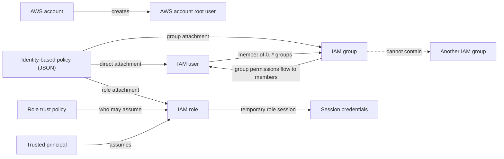
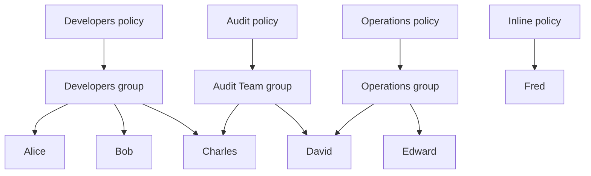

# AWS Identity and Access Management (IAM)

AWS IAM is a global service that connects identities to permission policies and credentials used to authenticate AWS access.

## Identity and permission model

The root user is created with the AWS account. Use its credentials only for
tasks that require root access, not for generic setup or routine work. Protect
root with MFA, do not create root access keys, secure its recovery channels,
and monitor root activity. In AWS Organizations, centralized root-access
management can remove credentials from member-account root users and provide
controlled privileged sessions for supported tasks.

## Entity constraints

| Entity | Course-level purpose | Constraints in this lesson |
| --- | --- | --- |
| Root user | Initial account identity | Created with the account; reserved from routine or shared use |
| IAM user | Long-lived identity for a person or workload when federation or roles cannot be used | May belong to zero or multiple groups and may have a console password, access keys, both, or neither |
| IAM group | Collects users with shared responsibilities | Contains users only; cannot contain another group |
| IAM role | Assumable identity for a trusted user, workload, or service | Has a required trust policy and no standard long-lived password or access keys |
| Identity-based policy | JSON document defining permissions for an identity | Can attach to a user, group, or role; group members receive the group's permissions |

The users-and-groups example demonstrates many-to-many membership: Charles is
in Developers and Audit Team, while David is in Operations and Audit Team.
Fred's zero-group membership is valid but is explicitly described as not best
practice.

## Course model versus production identity model

The course's phrase “two accounts” conflates account and identity. Creating an
IAM user alongside the root user still leaves one AWS account containing
multiple identities.

For production workforce access, current AWS guidance prefers federation,
commonly through IAM Identity Center, with temporary credentials. The
course's one-person-per-IAM-user rule should therefore be read as the durable
security invariant **one person, one non-shared identity**. If IAM users remain
necessary, their groups can centralize shared identity policies. IAM groups do
not contain federated identities; Identity Center and external identity
providers have separate group and assignment models.

Require MFA for human access and prefer phishing-resistant factors where
practical. An IAM account password policy applies only to IAM-user console
passwords; it does not control the root password, access keys, or passwords
managed by an external identity provider.

## Policy attachment and inheritance

A policy attached at group level becomes applicable to every member. Users in
multiple groups therefore have multiple group policies considered for their
requests. The course calls this policy inheritance.

An inline policy is embedded in a single identity. The lecture illustrates a
user inline policy for Fred; AWS also permits an inline policy on one group or
role. Inline policies maintain a one-to-one lifecycle with their identity and
are deleted with it. If one policy should be shared by multiple identities, AWS
recommends a managed policy instead.

## Policy document anatomy

| Element | Role | Scope or optionality |
| --- | --- | --- |
| `Version` | Policy language version; use `2012-10-17` for the current language | Top-level |
| `Id` | Policy identifier | Optional top-level element |
| `Statement` | One or more permission statements | Top-level collection |
| `Sid` | Statement identifier | Optional statement element |
| `Effect` | `Allow` or `Deny` | Statement element |
| `Principal` | Account or authenticated identity targeted by the statement | Resource-based policies only; prohibited in identity-based policies |
| `Action` | AWS API operations allowed or denied | Statement element |
| `Resource` | Resources to which the actions apply | Statement element |
| `Condition` | Request-context constraints for applying the statement | Optional statement element |

The first lesson's identity-based example grants describe/read-oriented actions
for EC2, Elastic Load Balancing, and CloudWatch. The second lesson's slide is an
S3 resource-based policy: its `Principal` names an AWS account, its actions are
`s3:GetObject` and `s3:PutObject`, and its resource is
`arn:aws:s3:::mybucket/*`.

The account principal ARN ending in `:root` delegates to the named AWS account;
it does not restrict the resource policy to only that account's root user.

## Identity-based versus resource-based policies

| Policy type | Attached to | How the principal is selected |
| --- | --- | --- |
| Identity-based | IAM user, group, or role | Implicitly selected by the attachment; do not include `Principal` |
| Resource-based | Supported AWS resource, such as an S3 bucket | Explicitly named with `Principal` |

Managed versus inline is a separate identity-policy placement choice. A managed
policy is standalone and reusable; an inline policy is embedded one-to-one in
one user, group, or role.

## Effective permission flow

1. Authenticate the principal and build the request context.
2. Collect applicable identity-based policies, including direct and group
   attachments, plus applicable resource-based policies.
3. Evaluate the policies against the requested action, resource, and
   conditions.
4. For the identity-based and resource-based combination, applicable allows
   form a union; an applicable explicit deny overrides an allow.

Other policy types can further constrain effective permissions. Permission
boundaries, session policies, service control policies, and resource control
policies are outside the course lessons ingested so far.

## Roles and service delegation

An IAM role is an identity with permission policies, but unlike an IAM user it
is not permanently associated with one person and has no standard long-lived
credentials. A trusted principal assumes the role and receives temporary
credentials for a role session.

For an AWS service role, authorization has three distinct boundaries:

1. the configuring identity must be allowed to pass the approved role to the
   service;
2. the role trust policy must allow the intended service principal to assume
   it;
3. permission policies on the role must allow the required API actions against
   the intended resources and conditions.

The course introduces EC2 instance roles, Lambda execution roles, and
CloudFormation roles. Their service-specific attachment mechanisms differ:
EC2 uses an instance profile, Lambda assumes an execution role, and
CloudFormation can assume a service role for stack operations. All use the role
as a temporary-credential and permission boundary rather than embedding an IAM
user's access keys in the workload.

## Programmatic credentials

An IAM-user access key is a long-lived credential pair containing an access key
ID and secret access key. It remains valid until deactivated or deleted. A
temporary credential set also has an access key ID and secret access key, plus
a session token and expiration.

Current AWS guidance is temporary-first:

- human users should use federation or IAM Identity Center;
- workloads should use IAM roles and temporary credentials;
- long-lived IAM-user keys are a fallback for cases that cannot use temporary
  credentials;
- root-user access keys should not be used for routine programmatic access.

The CLI and SDKs can discover multiple credential providers and are not limited
to IAM-user access keys. Credentials must remain identity-specific and must not
be shared.

## Security review telemetry

IAM exposes complementary review data:

| Surface | Scope | Main evidence |
| --- | --- | --- |
| Credential report | Account root row and IAM users | IAM-managed password, MFA, access-key, and signing-certificate status and dates |
| Last Accessed, called Access Advisor in the course | IAM users, groups, roles, and managed policies | Services allowed by identity permission policies, supported action data, recent authenticated attempts, and current granting policies |

The credential report is not a complete inventory of every AWS identity or
credential system. It excludes roles, federation and IAM Identity Center,
service-specific credentials, and credentials outside its documented fields.

Last-accessed data supports least-privilege review but is not a complete audit
trail. It includes denied attempts, can lag by several hours, has bounded
service and action coverage, omits several policy types from its allowed-service
calculation, and does not track `iam:PassRole` at action level. Use business
context and CloudTrail before removing access.

## Shared responsibility boundary

AWS operates and secures the IAM service, including its software,
infrastructure, availability, policy-evaluation implementation, and AWS-side
vulnerability remediation. Customers configure and govern how IAM is used:
root access, federation, users, groups, roles, policies, trust, role passing,
MFA coverage, credentials, monitoring, remediation, and customer-side
compliance.

AWS-managed policies, service-linked roles, authentication features, and
analysis tools can reduce operational work, but they do not approve the
customer's access design. The customer remains accountable for attachments,
configuration, evidence review, and the resulting permissions.

Configuration, patching, vulnerability management, monitoring, and compliance
can each be shared by layer. Determine the boundary for the selected AWS
service and control rather than assuming that AWS owns every task associated
with a managed service.

## Service scope

The course classifies IAM as global rather than Region-scoped. This is a
course-level service classification, not a claim that every resource governed
by IAM is global.

## Related

- [AWS shared responsibility model for IAM](../concepts/aws-shared-responsibility-model-for-iam.md)
- [AWS IAM security baseline](../practices/aws-iam-security-baseline.md)
- [Least-privilege access with AWS IAM](../practices/least-privilege-access-with-aws-iam.md)
- [Reviewing AWS IAM credentials and permissions](../practices/reviewing-aws-iam-credentials-and-permissions.md)
- [AWS IAM roles for services](../concepts/aws-iam-roles-for-services.md)
- [AWS programmatic credential handling](../practices/aws-programmatic-credential-handling.md)
- [AWS programmatic access: CLI and SDKs](aws-programmatic-access-cli-and-sdks.md)
- [AWS global infrastructure and service scope](aws-global-infrastructure.md)
- [IAM introduction source](../sources/2026-07-28-iam-introduction-users-groups-policies.md)
- [IAM policies source](../sources/2026-07-28-iam-policies.md)
- [AWS access keys, CLI and SDK source](../sources/2026-07-28-aws-access-keys-cli-and-sdk.md)
- [IAM roles for AWS services source](../sources/2026-07-28-iam-roles-for-aws-services.md)
- [IAM Security Tools source](../sources/2026-07-28-iam-security-tools.md)
- [IAM Best Practices source](../sources/2026-07-28-iam-best-practices.md)
- [Shared Responsibility Model for IAM source](../sources/2026-07-28-shared-responsibility-model-for-iam.md)
- [AWS Principal element reference](https://docs.aws.amazon.com/IAM/latest/UserGuide/reference_policies_elements_principal.html)
- [AWS managed and inline policy reference](https://docs.aws.amazon.com/IAM/latest/UserGuide/access_policies_managed-vs-inline.html)
- [AWS policy evaluation logic](https://docs.aws.amazon.com/IAM/latest/UserGuide/reference_policies_evaluation-logic.html)
- [AWS IAM security best practices](https://docs.aws.amazon.com/IAM/latest/UserGuide/best-practices.html)
- [AWS secure access-key guidance](https://docs.aws.amazon.com/IAM/latest/UserGuide/securing_access-keys.html)
- [AWS IAM role concepts](https://docs.aws.amazon.com/IAM/latest/UserGuide/id_roles.html)
- [AWS `iam:PassRole` guidance](https://docs.aws.amazon.com/IAM/latest/UserGuide/id_roles_use_passrole.html)
- [AWS credential-report documentation](https://docs.aws.amazon.com/IAM/latest/UserGuide/id_credentials_getting-report.html)
- [AWS last-accessed guidance](https://docs.aws.amazon.com/IAM/latest/UserGuide/access_policies_last-accessed.html)
- [AWS root-user best practices](https://docs.aws.amazon.com/IAM/latest/UserGuide/root-user-best-practices.html)
- [AWS MFA guidance](https://docs.aws.amazon.com/IAM/latest/UserGuide/gs-identities-mfa.html)
- [AWS IAM password-policy scope](https://docs.aws.amazon.com/IAM/latest/UserGuide/id_credentials_passwords_account-policy.html)
- [AWS centralized root access](https://docs.aws.amazon.com/IAM/latest/UserGuide/id_root-enable-root-access.html)
- [AWS Shared Responsibility Model](https://aws.amazon.com/compliance/shared-responsibility-model/)
- [AWS Well-Architected shared responsibility](https://docs.aws.amazon.com/wellarchitected/latest/security-pillar/shared-responsibility.html)
