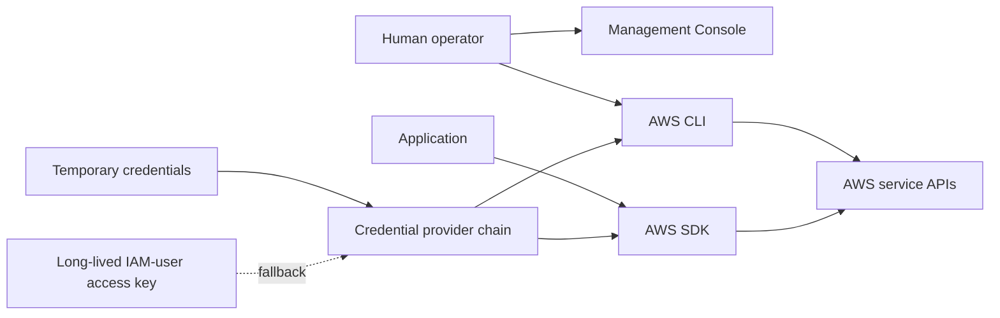

# AWS programmatic access: CLI and SDKs

The AWS CLI serves shell users and automation, while AWS SDKs embed service clients in applications; both authenticate through configurable credential providers.

## Access paths

| Interface | Runs in | Best fit |
| --- | --- | --- |
| Management Console | Web browser | Interactive visual administration |
| AWS CLI | Command-line shell | Interactive commands, shell scripts, and automation |
| AWS SDK | Application process | Programmatic service clients inside product or infrastructure code |

The interfaces reach the same underlying AWS service APIs through different
user experiences. Interface choice does not determine authorization; the
permissions of the authenticated identity do.

## AWS CLI

- The AWS CLI is an open-source tool for invoking AWS services from a shell.
- Its general command shape is `aws <service> <operation> [options]`; the course
  uses `aws s3 cp` as an example.
- Commands can be composed into scripts for repeatable resource management and
  automation.
- The CLI is an alternative interface to the console, not a separate set of
  service permissions.

## AWS SDKs

- An SDK supplies language-specific libraries and service clients for
  application code.
- SDK clients handle service endpoints, request signing, response parsing, and
  other common API mechanics.
- AWS publishes SDKs for multiple server, browser, mobile, and device
  environments. Consult the current SDK catalog rather than preserving the
  course's language list as a fixed inventory.

## Credential provider chain

CLI and SDK authentication is a provider-selection problem, not simply an
access-key file. AWS tools and SDKs search supported providers in a defined
precedence order and stop after finding valid credentials.

Common provider categories include:

- browser or console login for local development;
- IAM Identity Center;
- assume-role and web-identity providers;
- ECS/EKS container credentials;
- EC2 instance metadata credentials;
- external credential processes;
- shared configuration or credential profiles;
- environment or explicitly supplied access keys.

Temporary providers can refresh credentials automatically. Prefer them over
embedding or distributing long-lived IAM-user access keys. The exact provider
order varies by SDK or tool, so consult the relevant implementation guide when
precedence matters.

On AWS compute services, an associated IAM role is the usual runtime provider:
the service assumes the role, supplies temporary credentials, and refreshes
them. Application code should let the SDK provider chain discover those
credentials instead of copying them into configuration.

## Python implementation relationship

The course says the AWS CLI is built on the Python SDK “Boto.” More precisely,
Botocore is the low-level library shared by the AWS CLI and Boto3, while Boto3
is the AWS SDK for Python. This implementation relationship can change by
version and is not an authentication contract.

## Related

- [AWS programmatic credential handling](../practices/aws-programmatic-credential-handling.md)
- [AWS IAM roles for services](../concepts/aws-iam-roles-for-services.md)
- [AWS Identity and Access Management (IAM)](aws-identity-and-access-management.md)
- [Source lesson](../sources/2026-07-28-aws-access-keys-cli-and-sdk.md)
- [IAM roles for AWS services source](../sources/2026-07-28-iam-roles-for-aws-services.md)
- [AWS CLI introduction](https://docs.aws.amazon.com/cli/latest/userguide/cli-chap-welcome.html)
- [AWS SDK and tool authentication](https://docs.aws.amazon.com/sdkref/latest/guide/access.html)
- [AWS standardized credential providers](https://docs.aws.amazon.com/sdkref/latest/guide/standardized-credentials.html)
- [Boto3 and Botocore relationship](https://docs.aws.amazon.com/boto3/latest/guide/quickstart.html)
